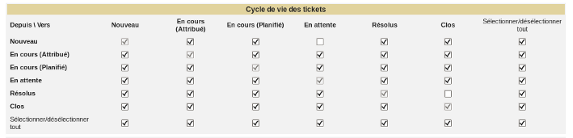
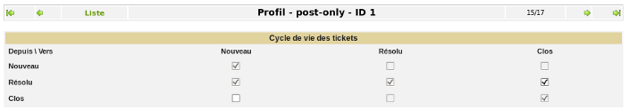
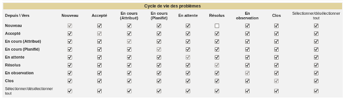
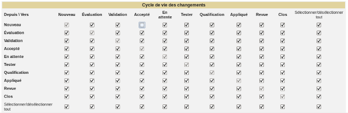

Les matrices
============

Chaque profil possédant sa propre matrice de cycle de vie, vous pouvez
affiner quel profil pourra faire quelle action.

La matrice vous permet d'empêcher l'objet de passer de tel à tel statut,
ce qui fait qu'elle peut bloquer certaines actions de GLPI. Si un statut
est désactivé, il ne sera pas présent dans la liste des statuts de
l'objet.

Matrice de cycle de vie des tickets
-----------------------------------

Voir `Les règles de gestion d'un
ticket <04_Module_Assistance/06_Tickets/01_Règles_de_gestion.rst>`__.

Figure 1. Matrice de cycle de vie d'un ticket interface standard |image|

Dans l'exemple ci-dessus, un ticket Nouveau ne pourra jamais être mis En
attente, ce statut n'étant pas proposé dans le ticket.

De plus, un demandeur ou créateur n'aura pas le formulaire de validation
de la solution, car un ticket résolu dont la solution est approuvée
devient clos, ce que l'exemple n'autorise pas.

Figure 1. Matrice de cycle de vie d'un ticket interface simplifiée
|image|

Pour l'interface simplifiée, le cycle de vie des tickets permet de
définir si l'utilisateur a le droit de clore un ticket (approbation de
la solution) et s'il a le droit de le ré-ouvrir même s'il est clos.

Matrice de cycle de vie des problèmes
-------------------------------------

Voir `Les règles de gestion d'un
problème <04_Module_Assistance/08_Problèmes.rst>`__.

Figure 1. Matrice de cycle de vie d'un problème |image|

Dans l'exemple ci-dessus, un problème Nouveau ne pourra jamais être mis
directement au statut Résolu, ce statut n'étant pas proposé dans le
problème.

Matrice de cycle de vie des changements
---------------------------------------

Voir `Les règles de gestion d'un
changement <04_Module_Assistance/09_Changements.rst>`__.

Figure 1. Matrice de cycle de vie d'un changement |image|

Dans l'exemple ci-dessus, un changement Nouveau ne pourra jamais être
Accepté sans être passé auparavant par la statut Evaluation ou
Validation, ce statut n'étant pas proposé dans le changement.

