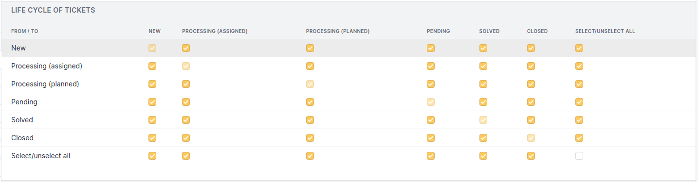
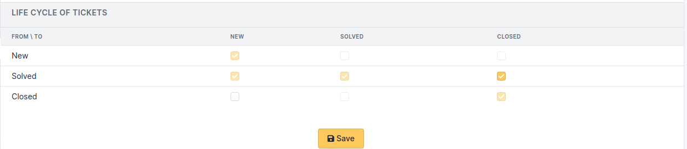
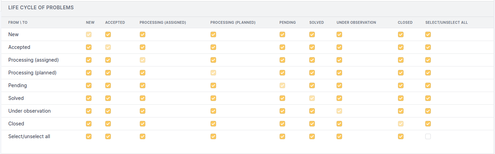
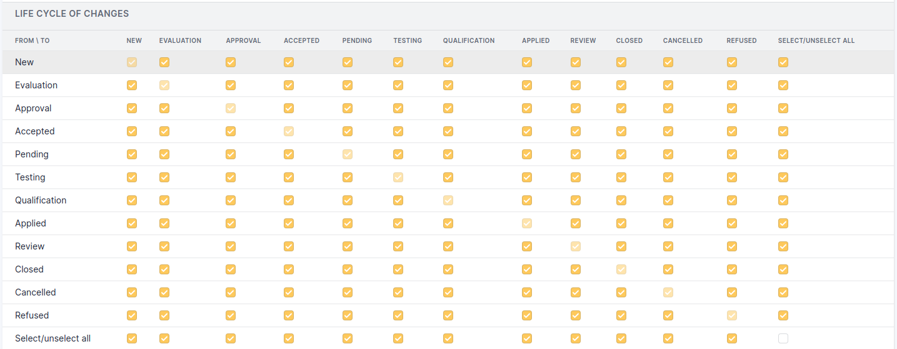

Life cycle matrix
=================

Each profile having its own life cycle matrix, it is possible to refine which profile will be able to do which action.

The life cycle matrix controls object status changes, which implies it can block some actions. If a status is not activated, it won't be present in the list of status of the object.

Ticket life cycle matrix
------------------------

See :doc:`Ticket management rules </modules/assistance/tickets/ticketmanagement>`.

In example above, a `New` ticket will never be put to `Waiting`, this status being not proposed in the ticket.

Furthermore, a requester will not have access to solution validation form, because a solved ticket for which solution has been approved becomes closed, which is not authorized by the example.

For the simplified interface, ticket life cycle allows to define if user can close a ticket (solution approved) and if user can re-open it event if it is closed.

Problem life cycle matrix
-------------------------

See :doc:`Ticket management rules </modules/assistance/problems>`.

In example above, a `New` problem will never be put directly to status `Solved`, this status being not proposed in the problem.

Change life cycle matrix
------------------------

See :doc:`Ticket management rules </modules/assistance/changes>`.

In example above, a `New` change will never be `Accepted` before having its status put to `Evaluation` or `Validation`, this status being not proposed in the change.

