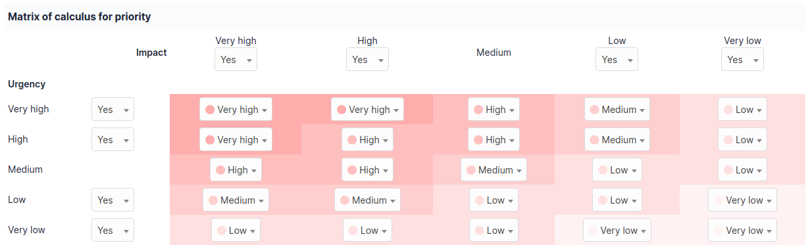

Matrix of calculus for priority
===============================

This matrix is common to all help desk items (tickets, problems and changes) and can be parameterized in tab `Assistance` of menu **Setup > General**.

ITIL best practices separate urgency (as defined by the user) from incident impact (a user, a service, a functionality...) which is usually set by the technician. A matrix is then used to compute the priority associated to the item of the help desk (ticket, problem or change) as a function of both urgency and impact. GLPI provides a default predefined matrix which corresponds to standard cases.

This predefined matrix can be modified in tab `Assistance` of menu **Setup > General** (see :doc:`Configure general parameters </modules/configuration/general/index>`.

Knowing that the order of items processing by technicians is based on priority, it is possible to select the different levels of urgency, impact or priorities that will be used in the help desk and to disable some of them. This action allows to ease declaration of an incident and its processing. To disable a level, this level must be set to `No`. Medium level cannot be disabled.

In example above, the urgency level `Low` will not be proposed to requester and the impact level `High` will not be proposed to the technician.

.. note::
   
   The **Major** priority used by tickets is not part of the matrix. This level is higher than any other and requires the permission to modify priority in order to be able to assign it. A **Major** incident is a ticket whose processing is of such high importance that it overrides any other ticket.

