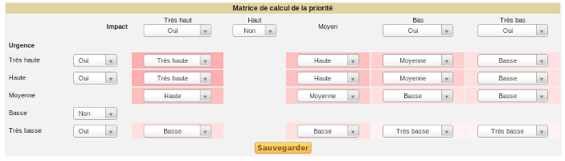

Matrice de calcul de la priorité
================================

Cette matrice est commune à tous les éléments du helpdesk (tickets,
problèmes et changements) et se paramètre dans l'onglet *Assistance* du
menu **Configuration > Générale**.

Les bonnes pratiques ITIL séparent l'urgence (définie par
l'utilisateur), de l'impact de l'incident (un utilisateur, un service,
une fonction...) qui est normalement renseigné par le technicien. Une
matrice est alors utilisée pour calculer la priorité associée à
l'élément du helpdesk (ticket, problème ou changement) en fonction de
ces deux critères. GLPI fournit une matrice standard prédéfinie qui
permet de retrouver un fonctionnement identique au helpdesk dans les
versions précédentes de l'application (où ces deux notions d'urgence et
impact n'existaient pas).

Cette matrice pré-définie est modifiable et se trouve dans l'onglet
*Assistance* du menu **Configuration > Générale** (Voir `Configurer les
paramètres
centraux <08_Module_Configuration/06_Générale/01_Configurer_les_paramètres_centraux.rst>`__).

Tout en sachant que l'ordre de traitement des éléments par les
techniciens est basé sur la priorité, il est possible de sélectionner
les différents niveaux d'urgence, d'impact ou de priorités qui seront
utilisés dans le helpdesk et d'en désactiver certains. Cette action peut
permettre de faciliter la déclaration et la qualification. Pour cela, il
suffit de définir le niveau choisi à Non. Il faut noter que le niveau
moyen n'est pas désactivable.

Figure 1. Matrice de calcul de la priorité |image|

Dans l'exemple ci-dessus, le niveau d'urgence Basse ne sera pas proposé
au demandeur et le niveau d'Impact Haut ne sera pas proposé au
technicien.

***Remarque :** la priorité **majeure** utilisée par les tickets ne fait
pas partie de la matrice. Celle-ci est supérieure aux autres, et
nécessite le droit de modifier la priorité pour pouvoir l'assigner. Un
incident majeur représente un ticket dont le traitement est tellement
important qu'il prend le pas sur tous les autres.*

