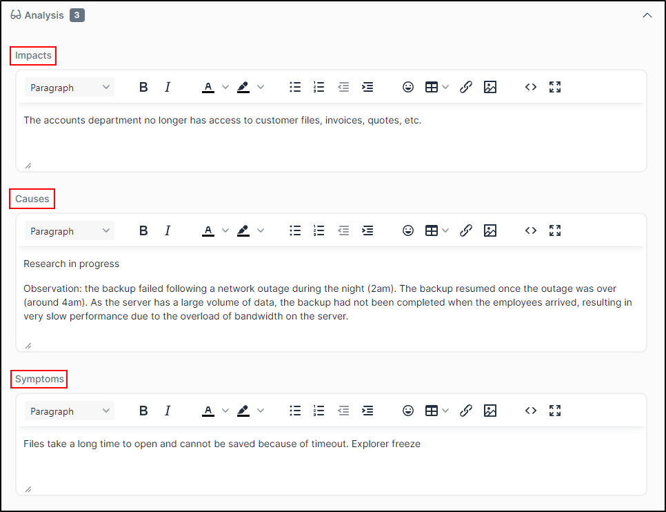
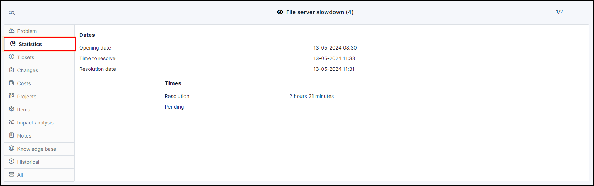
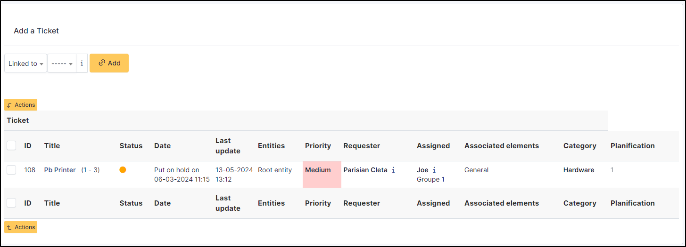
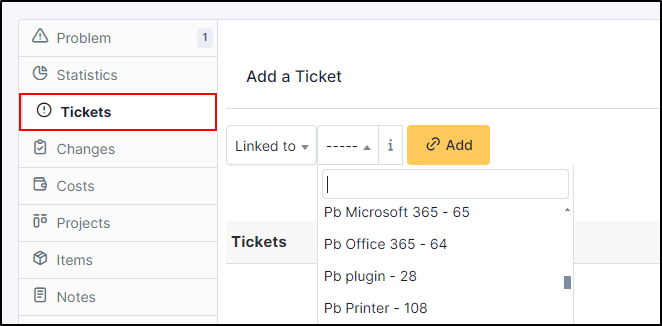
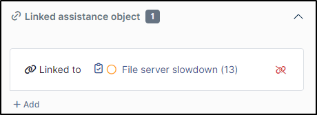
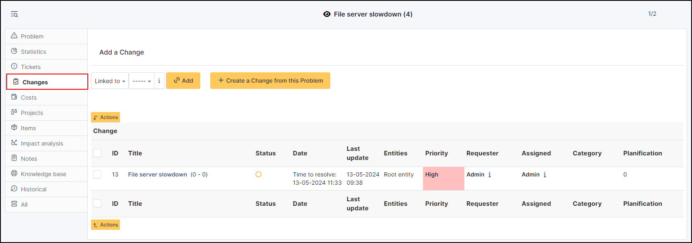
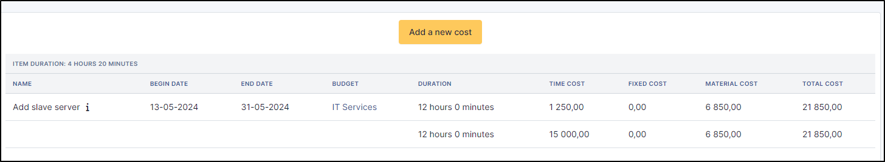
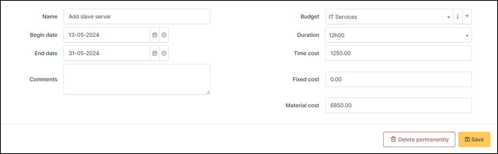
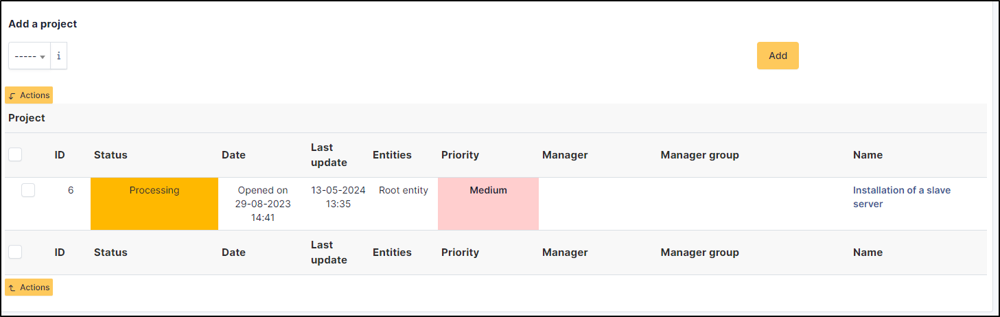

Manage problems
===============

A problem is the cause of potential incidents and, once identified, can be managed in GLPI.

Creating a problem object can be done either from the ticket form, in tab *Problem*, or directly from menu *Assistance > Problems*.

The problem creation form is very similar to the ticket creation form and shares with it many concepts: `Requester`, `Watcher`, `Assigned to`, `Status`, `Urgency`, `Impact`, `Priority`, `Category`. For more information, see :doc:`Manage tickets </modules/assistance/tickets/ticketmanagement>`.

.. todo::
   Check what is means
   From tickets list, an alternative solution can be associated to linked tickets without solving the problem.
   Depuis la liste des tickets, une solution de contournement peut être associé massivement aux tickets liés sans pour autant résoudre le problème.

Problems use their own notifications, see :doc:`configuration of email follow-ups <email_notifications>`.

Statistics similar to tickets are available for problems, see :doc:`Display statistics </modules/assistance/statistics>`.

The different tabs
------------------

Analysis
~~~~~~~~

This tab contains problem analysis.

It consists of 3 inserts:

* Impacts
* Causes
* Symptoms

Statistics
~~~~~~~~~~

Statistics similar to tickets are available for problems.

Tickets
~~~~~~~

List all :doc:`tickets <tickets>` are linked to the problem. You can add a new ticket or link an existing ticket

Changes
~~~~~~~

This tab allows to display changes associated with the problem and add new changes. See :doc:`changes <changes>`

Costs
~~~~~

The cost represents the financial impact of the problem encountered. It can be human, material or fixed.

.. warning:: A cost cannot be added once the problem has been closed or resolved.

Projects
~~~~~~~~

You can attach or add one or more :doc:`projects <../tools/projects>` to your problem.

Tasks
~~~~~

A task is an action linked with a problem, usually a technical intervention. See :doc:`Tasks </Les_différents_onglets/Onglet_Tâches>`

Items
~~~~~

This tab allows to attach an item to the problem by choosing the type and the selected item.
See :doc:`Items <../tabs/items>`

Impact analisys
~~~~~~~~~~~~~~~

:doc:`Impact analysis <../../tabs/impact_analysis>` enables you to visualise the impact of failures on an entire infrastructure

.. include:: ../tabs/notes.rst

Knowledge Base
~~~~~~~~~~~~~~

You can link an article from the :doc:`knowledge base <../tabs/knowledgebase>`.
It is possible to add a new article by clicking on **i**

.. include:: ../tabs/historical.rst

.. include:: ../tabs/all.rst
