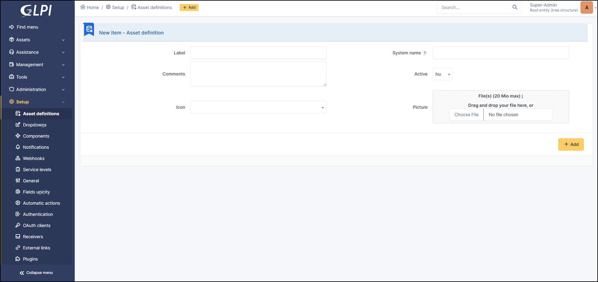
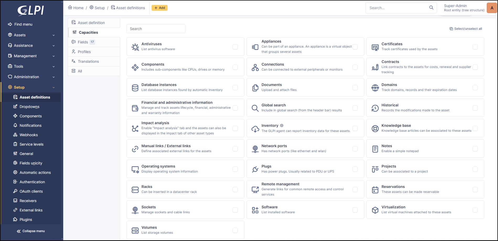
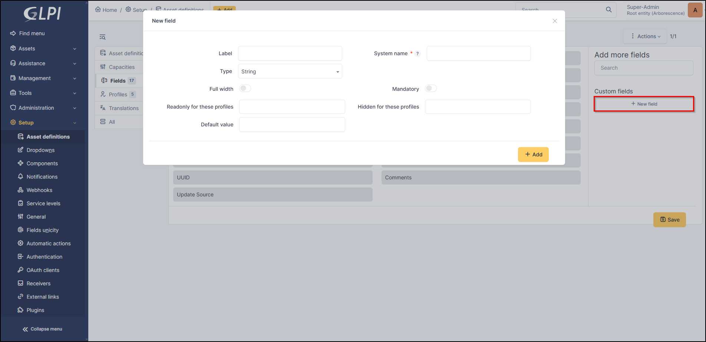
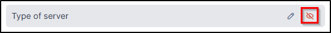
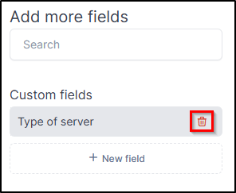
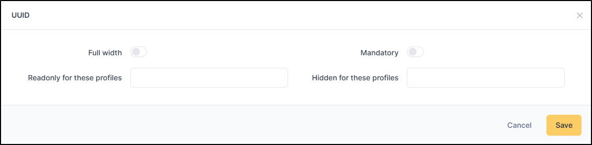
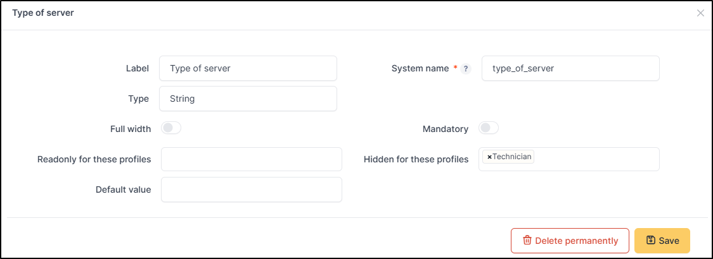
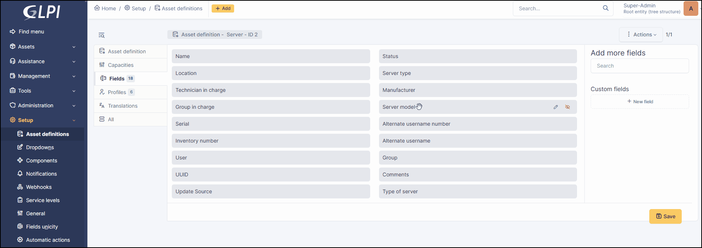
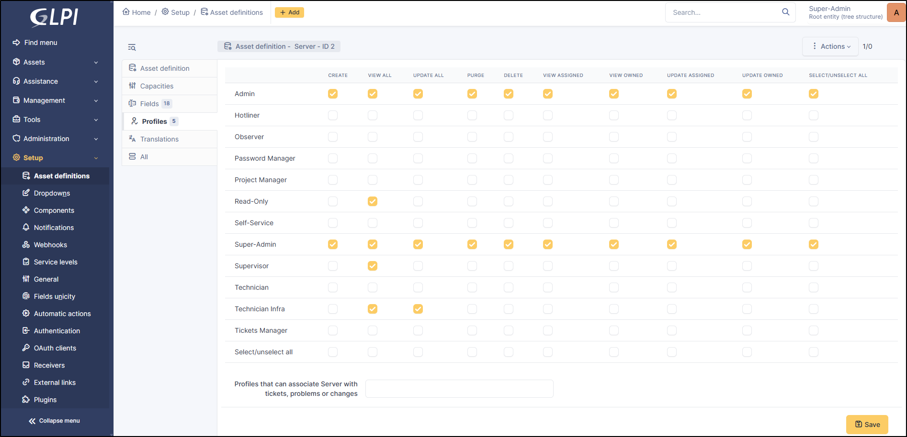
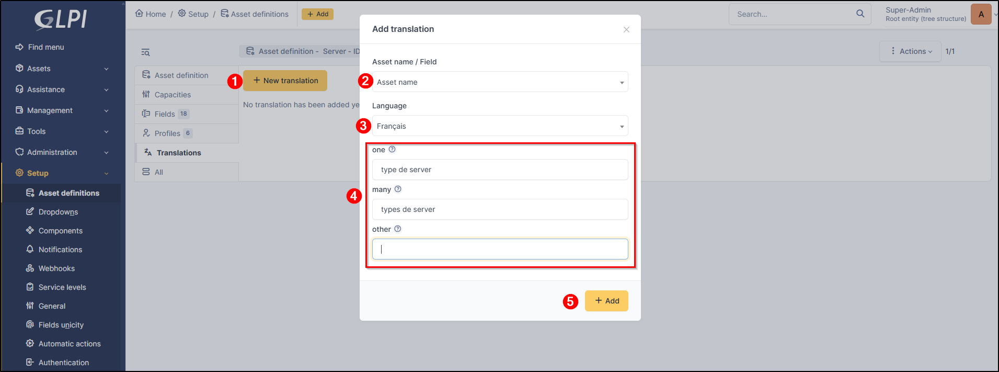

Asset Definitions
=================

Since GLPI 11, the generic asset plugin has been integrated into GLPI natively.
This makes it possible to create customised asset types to suit your needs.

Migration generic objects to asset definitions
---------------------------------------------

.. warning:: generic assets migration must be done from the GLPI 10 database. It is not possible to import your assets from GLPI 10 to GLPI 11.

When migrating your instance to GLPI 11, the **generic objects** plugin must be installed.
Once the migration is complete, enter the command in :term:`CLI` mode from your GLPI folder:

``php bin/console migration:genericobject_plugin_to_core``

Definitions
-----------

Asset definitions can be used to add assets that are not natively available. For example, you can add servers or laptops separately from the native Computers type.
Each custom asset could be configured to behave like any other asset via capacities.

Create an asset
---------------

* To add a new asset, click on **+ Add**
* Fill in the information for the new asset

* Label (this field will appear in the list of assets)
* System name (it cannot be changed later)
* Comments
* Active
* Icon

.. note:: The **system name field** correspondands to what will be used when development is involved.
   Examples : API calls, webhooks, etc.
   It can be personnalized, but some words are reserved such as classes from GLPI like Computer, Monitor, etc.
   Items linked to the system name "Example" will have the class "Glpi\CustomAsset\ExampleAsset"

After the creation, an error message appears : There is currently no profile with access to items with current definition
You need to go to :doc:`profiles <#profiles>`

Capacities
----------

Capacities lets you add behaviors such as the ability to link software, network ports, contacts, etc. to the asset.
Each asset can be selected and customised as required.

List of the behaviors/elements that can be linked:

* Antivirus
* Appliances
* Certificates
* Components
* Connections
* Contracts
* Databases instances
* Documents
* Domains
* Financial and administrative information
* Global search
* Historical
* Impact analysis
* Inventory
* Knowledge base
* Manual links / External links
* Network ports
* Notes
* Operating systems
* Plugs
* Projects
* Racks
* Remote management
* Reservations
* Sockets
* Software
* Virtualization
* Volumes

Fields
------

The fields tab is used to add additional fields and and hide, or reorder native ones.
You can customise them by indicating whether they should be text, URL, date, etc.

Create a custom field
~~~~~~~~~~~~~~~~~~~~~

* To add a new field, click on **+ New field**
* Fill in the required fields

* **Label**: name which will be displayed on the asset form, search results, etc
* **System name**: The system name field corresponds to what will be used when development is involved. Examples: API calls, webhooks, etc.
  In the legacy API, the field name is prefixed by ``custom_``; to avoid conflicts with standard fields.
* **Type**: string, date, URL, dropdown, yes/no, text, date and time, number. Cannot be modified once saved
* **Full width**: indicates the field will be extended along the entire length of the form
* **Mandatory**: make it mandatory or not to fill in the field before saving the asset
* **Readonly for these profiles**: select one or more profiles with read-only access to this field.
  The permissions in the profiles tab take precedence over this field.
* **Hidden for these profiles**: select one or more profiles whose fields will be hidden
  The authorisations in the profiles tab take precedence over this field. It will therefore be visible to a profile even if it is selected in this field.
* **Default values**: specify a default value

.. note:: For dropdown list, you need to select the item type in the list. You can specify if multiple selections are allowed. You can also select a default value if necessary.

   .. image:: images/dropdown_field.png
      :alt: Dropdown list selection
      :scale: 61%

   .. collapse:: Dropdown list details

       * Computers
       * Monitors
       * Network devices
       * Peripherals
       * Phones
       * Printers
       * Licenses
       * Certificates
       * Unmanaged assets
       * Appliances
       * Software
       * Cartridge models
       * Consumable models
       * Lines
       * Passive devices
       * PDUs
       * Tickets
       * Changes
       * Problems
       * Recurrent tickets
       * Budgets
       * Suppliers
       * Contacts
       * Contracts
       * Documents
       * Projects
       * Certificates
       * Appliances
       * Databases
       * Reminders
       * RSS Feed
       * Users
       * Groups
       * Entities
       * Profiles
       * Locations
       * Statuses of items
       * Manufacturers
       * Blacklists
       * Blacklisted mail content
       * Default filters
       * ITIL category
       * Task categories
       * Task templates
       * Solution types
       * Solutions templates
       * Approval templates
       * Request sources
       * Followup templates
       * Project states
       * Project types
       * Project tasks types
       * Project tasks templates
       * External events templates
       * Event categories
       * Pending reason
       * Service catalog categories
       * Approval steps
       * Computer types
       * Networking types
       * Printer types
       * Monitor types
       * Devices types
       * Phone types
       * License types
       * Cartrige types
       * Consumable types
       * Contract types
       * Contact types
       * Generic types
       * Sensor types
       * Memory types
       * Third party types
       * Interface types (Hard drive...)
       * Cases types
       * Phone power supply types
       * Files systems
       * Certificate types
       * Budget types
       * Simacard types
       * Line types
       * Rack types
       * PDU types
       * Passive device types
       * Cluster types
       * Database instance type
       * Computer models
       * Networking models
       * Printer models
       * Monitor models
       * Peripheral models
       * Phone models
       * Device camera models
       * Device case models
       * Device control models
       * Device drive models
       * Device generic models
       * Device graphic card models
       * Device hard drive models
       * Device memory models
       * System board models
       * Other component models
       * Device power supply models
       * Device processor models
       * Device sound card models
       * Device sensor models
       * Rack models
       * Enclosure models
       * PDU models
       * Passive device models
       * Virtualization systems
       * Virtualization models
       * States of the virtual machine
       * Document heading
       * Document types
       * Business criticies
       * Databse instance categories
       * Knowledge base categories
       * Calendars
       * Close times
       * Operating systems
       * Versions of the operating systems
       * Service packs
       * Operating systems architectures
       * Editions
       * Kernels
       * Kernels versions
       * Update sources
       * Networking interfaces
       * Networks
       * Network port types
       * VLANs
       * Line operators
       * Domain types
       * Domain relations
       * Records types
       * Fiber types
       * Cables types
       * Cable strands
       * Socket models
       * IP networks
       * Internet domains
       * Wifi networks
       * Networks names
       * Software categories
       * Users titles
       * User categories
       * LDAP criteria
       * Ignored values for the unicity
       * Fields storage of the login in the HTTP request
       * Plugs
       * Appliance types
       * Appliance environments
       * Resolutions
       * Image formats
       * USB vendors
       * PCI vendors
       * Webhook categories

Delete a custom field
~~~~~~~~~~~~~~~~~~~~~

.. warning:: It is **not possible** to **delete** a field **created by default**. Only fields added by the user can be deleted. However, it is possible to hide any field.

* To delete a custom field, click on the hide icon

* Then, click on the trashbin icon. Note that this action is irreversible

Hide or show a field
~~~~~~~~~~~~~~~~~~~~

Each field can be hidden in the asset form.

* To hide a field, click on the hide icon

* To restore an hidden field, drag and drop this field in the list

Modify a field
~~~~~~~~~~~~~~

You can change all the fields, but some information cannot be changed in a default field.

In a default field, you can modify :

* **Full width**
* **Mandatory**
* **Readonly for these profiles**
* **Hidden for these profiles**

In a custom field, you can modify :

* **Label**
* **System name** (will be modified automatically when changing the label)
* **Full width**
* **Mandatory**
* **Readonly for these profiles**
* **Hidden for these profiles**
* **Default value**

.. warning:: The **type** of field **cannot be modified** once it has been saved

Change the order
~~~~~~~~~~~~~~~~~

To change the order of the list of fields, drag and drop your field to the desired position.

Profiles
--------

The profiles tab is used to authorise certain permissions on the assets of this type

You can define the following permissions for each profile:

* Create
* View all
* Update all
* Purge
* Delete
* View assigned
* View owned
* Update assigned
* Update owned

You can add **profiles that can associate Server with tickets, problems or changes**. This tab allow multiple selection

Translations
------------

You can translate the **label** and the **system name**

* Click on **+ New translation**
* Select the field to **translate**
* Select the **language**
* Indicate the desired translations
* Click on **+ Add**

1. Add a new translation
2. Select the field to translate
3. Select the language
4. Fill in the translation fields:
  * One - the singular form of the label
  * Many - the plural form of the label
  * Other - the translation that will appear in the list of assets

.. include:: ../../tabs/all.rst