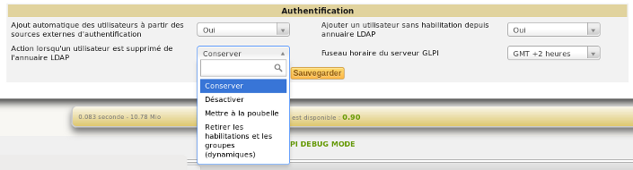

Configure external authentication
=================================

This menu allows you to configure the general settings for integration with external authentication sources.

In order to be able to use these external authentication sources, the corresponding extensions must first be activated in the PHP configuration. There is no limit to the number of external sources configured in the application.

To use the capacity of GLPI to create on the fly users present in the external sources of authentication, it is necessary to activate it in the menu Configuration \> Authentication \> Configuration. 

   
The LDAP directories also allow you to refuse the creation of users who do not have authorizations.
Deleting a user from the directory can also lead to an action such as trashing the user, deleting his permissions or deactivating him.
You also have the option to specify how to handle users that were previously deleted from the directory but are now restored.
You can set the restore action to do nothing, restore the user from the trashbin, or re-enable the user.

It is also at this level that the time zone of GLPI is set.

External authentication sources that can be used inside GLPI are:

*  :doc:`LDAP directories <ldap>`
*  :doc:`Email servers <imap>`
*  :ref:`CAS server <auth_cas>`
*  :ref:`x509 certificate <auth_x509>`
*  :ref:`Delegate authentication to web server <auth_other>`
