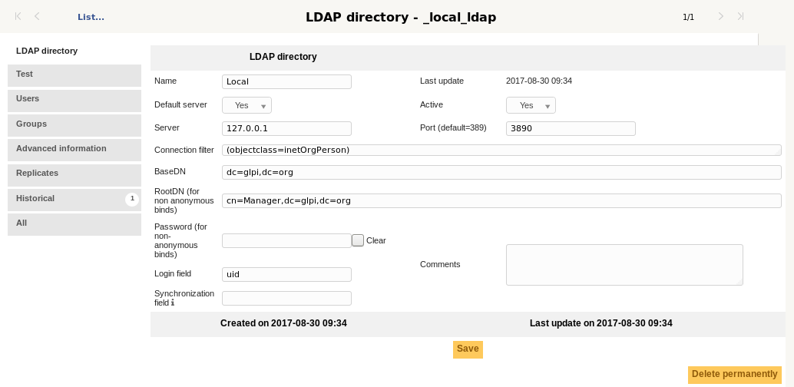
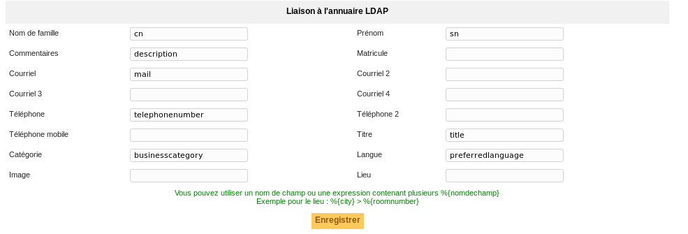
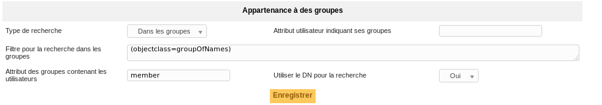
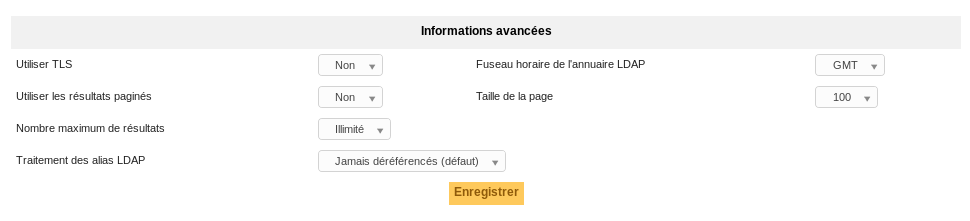

LDAP directories
================

GLPI can interface with one or more :term:`LDAP directories <LDAP directory>`  in order to authenticate users, control their access, retrieve their personal information and import groups.

All the directories compatible LDAP v3 are supported by GLPI. It is thus also the case for the ':term:`Active Directory <Active Directory service>` of Microsoft.
There is no limit as to the number of directories informed. However, the higher the number, the longer the search for a new user to authenticate can be.

It is possible to import and synchronize users in 2 ways:

* At the first login, the user is created in GLPI. At each login, his personal information is synchronized with the directory.
  In the case where the receivers are used and there is an email not associated with an existing user, the unknown email address will be searched in the directory to create the associated user.
* In mass either via the web interface or the CLI `glpi:ldap:synchronize_users` command.

.. warning::

   If no LDAP configuration is visible (see an error message on this part) it means that the LDAP module for PHP is not installed.

   Under Linux, install the ldap package for PHP (for example *php7.4-ldap* on Debian), then restart the web server.

   Under Windows it is necessary to uncomment in the file *php.ini* (file present in the directory *apache/bin*) the line *extension=php\_ldap.dll* then restart the Web server.

The process of authentication of the users is divided into 3 parts: authentication, access control and finally the recovery of the personal data.

LDAP Authentication
-------------------

At the time of the first login of the user, GLPI will search all of the configured directories until finding one that contains the user.
If the option allowing to import users from an external source is active, then the user is created and the identifier of the method of connection and the LDAP server are stored in database.

Then, at each login the user is authenticated on the directory whose identifier is stored in GLPI.
The other directories are not used; If a user is deactivated in the directory which it used until then to connect, it cannot connect with another source of authentication.

Access Control
----------------

Access control is the assignment of permissions to a user.
Even if a user is authenticated on a directory it is not necessarily entitled to connect to GLPI.

This mechanism is based on the use of Authorization Assignment Rules.

The different tabs
------------------

LDAP directory
~~~~~~~~~~~~~~

.. note::

   There is an Active Directory pre-configuration template, which pre-fills a certain number of fields.

   To load it, click on the **Active Directory** link when adding a directory. The **Default value(s)** link will reset the values to the default.

* **Default server**: If you have multiple LDAP servers set up, you can only define one default server. Choosing this setting will remove it from the server it was previously set to.
* **Server** and **Port**: Represent the address and port of the LDAP directory.
   GLPI can connect to an LDAP directory through an LDAPS connection. To enable this, prefix your server field with *ldaps://* and change the port to the LDAPS one of your LDAP directory (default 636).

* **Connection filter**: Allows you to restrict the search for users in the directory. For example, if only a restricted set of users have the right to connect to GLPI, you can create a condition to restrict the search to that set of users.

   Some example filters:

   * A classic LDAP filter: ``(objectclass=inetOrgPerson)``
   * An Active Directory filter to return only enabled users: ``(&(objectClass=user)(objectCategory=person)(!(userAccountControl:1.2.840.113556.1.4.803:=2)))``

    The example Active Directory filter is automatically populated when the Active Directory pre-configuration template is selected.
* **BaseDN**: The location in the directory from which the searches will be made.
* **RootDN**: The distinguished name of the user account to authenticate to LDAP with when not using anonymouse binds.

.. note::

   RootDN and BaseDN are case sensitive and must not contain spaces betwen the parts.
   Examples:

   * ``cn=Admin, ou=users, dc=mycompany``: incorrect
   * ``cn=Admin,ou=users,dc=mycompany`` : correct

* **Password**: The password for the account specified (if any) in the RootDN field.
* **Login field**: The name of the field in the LDAP directory corresponding to the user's login (Ex: ``uid`` in LDAP or ``samaccountname`` in Active Directory).
* **Synchronization field**: The name of the field in the LDAP directory used for Synchronization. This field must be unique for every user (Ex: ``employeeuid`` in LDAP or ``objectguid`` in Active Directory).

The parameters to enter are simple. For example:

* Server: `ldap.mycompany.fr`
* BaseDN: `dc=mycompany,dc=fr`

This should be enough if anonymous binds are allowed.
If not, and if all users are not located within the same DN, you have to specify the DN of an authorized user and his password through the RootDN/Password parameters.
For Active Directory, it is required to specify an account that has the right to authenticate on the domain.

.. note::

   If some of the users have connection restrictions to certain machines configured in their Active Directory profile, a user not found error may be seen.
   The solution is to add the Active Directory server to the list of computers the user is allowed to connect to.

.. warning::

   Do not forget to activate your directory and set it as the default (if wanted) if you have multiple directories.

Test
~~~~

Allows the testing of the configuration defined in the LDAP directory tab.

The message **Connection test successful** indicates that GLPI was able to connect to the LDAP directory with the information provided (host, port, user account).

It remains now to import the users. For that, it is necessary to check the other parameters (connection filter, login field, etc).

Users
~~~~~

Allows you to configure how the link between the fields of the directory and those of GLPI will be made. Most of the fields are automatically mapped for you but can still be changed.

Groups
~~~~~~

Allows you to configure the method for retreiving groups from the LDAP directory.

Advanced Information
~~~~~~~~~~~~~~~~~~~~

In case the server hosting the LDAP directory is in a different timezone as GLPI, it is necessary to modify the **Timezone** variable to account for the difference.

**Limit of the number of records returned**

There are often two limits on the number of records retured per request.

* The client limit (defined for example on Debian/Ubuntu in ``/etc/ldap/ldap.conf``)
* The server limit: If the server limit is lower than the client limit, then that is the effective limit

.. warning::

   If the limit is reached, the optional GLPI behavior for LDAP user deletion can not work.
   Moreover, GLPI will display a warning message during the import or synchronization.

It is possible to bypass the limitation by enabling **Pagination of results** in the **Advanced Information** tab of the LDAP directory in GLPI.
This will split requests into smaller requests that are under the configured limit.

The **Page size** option adjusts the number of results retreived per "page" with pagination enabled.
The **Maximum number of results** option is the limit for the total number of records. This option may be useful to avoid high memory usage.

.. note::

   On an OpenLDAP directory, the default limit is 500 and in Active Directory, it is 1000.

   In Active Directory it is possible to modify the value of `MaxPageSize` with the following commands (This modification is global for the whole directory):

   .. code-block:: none

      C:> ntdsutil
      ntdsutil: ldap policies
      ldap policy: connections
        server connections: connect to server 192.168.1.1 ( here a few messages regarding connectivity are displayed)
      server connections : q
      ldap policy : show values ( here we will see all the values including MaxPageSize which is 1000 currently)
      ldap policy : set maxpagesize to 5000
      ldap policy : commit changes
      ldap policy : q
      ntdsutil : q

Replicates
~~~~~~~~~~

If an LDAP directory is not accessible, the users provided by it will not be able to connect to GLPI.

To help avoid this situation, replicates can be declared in GLPI. These are LDAP servers that have the same data as the main server, but are available at a different address.

Replicates are only used when the connection to the main server is lost.
The addition of replicates in GLPI is done by entering a **Name** which is displayed in GLPI, as well as a **Server**, **Port**, and **Timeout** in the **Replicates** tab in the LDAP directory.
To enable LDAPS, prefix your server entry with *ldaps://* and change the port to the LDAPS one of your LDAP directory (default 636).
There is no limit to the number of replicates per LDAP directory.

.. include:: ../../tabs/historical.rst

.. include:: ../../tabs/all.rst

The different actions
---------------------

See the :doc:`common actions <../../overview/actions>`.
