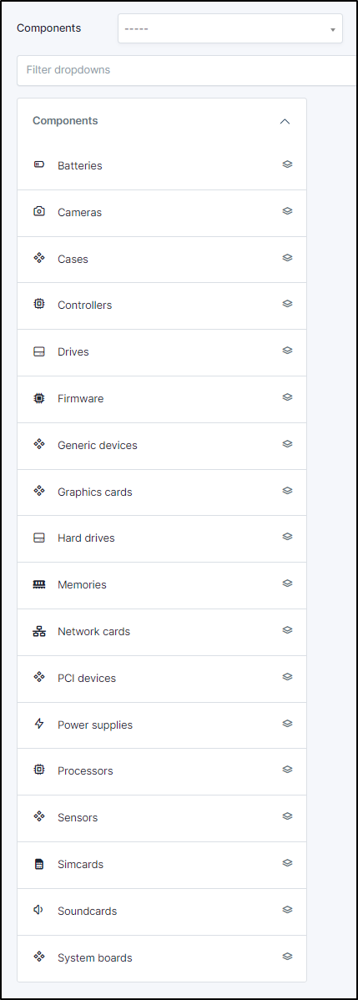
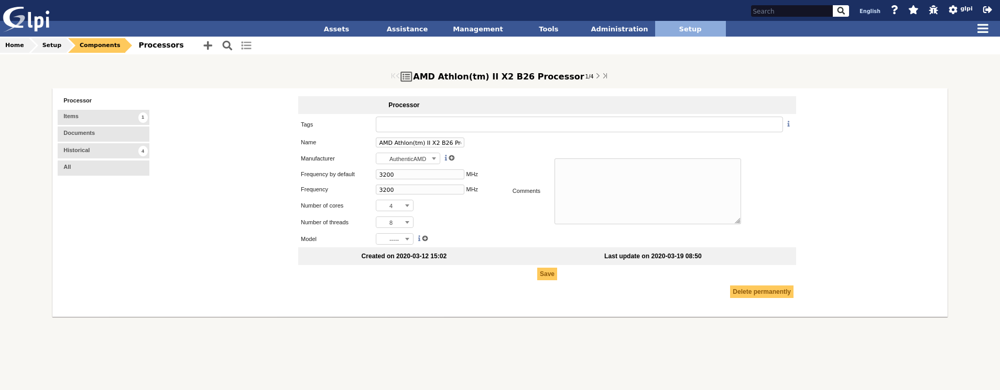

Components
==========

The hardware components that can be added to computers are configurable.

A hardware component is defined by a type, a name, a manufacturer, a comment, and several fields specific to the type of component.
For example, for a system board, you can enter the chipset.

.. note::
   It is possible to fill in other component types inside the *Other Components* type.
   However, it is not possible to add other types than those listed here.

Once a component type has been selected (*Motherboard*, *Processor*...), you are redirected to the list of components already created.

.. image:: images/component_list.png
   :alt: List of components
   :align: center

The different tabs
------------------

Main
~~~~

Information that defines a hardware component (different information depending on the type of component).

Example for a Processor:

Items
~~~~~

The elements tab allows to visualize the computers linked to the component.

.. image:: images/component_elements.png
   :alt: Component associated items
   :align: center

.. note::

   -  **It is possible to modify the characteristics of a component only for the linked item**

      From the *Elements* tab of the component, click on the **Update** link.

      Several tabs are then proposed:

      *  `Element - Component name link tab`: lists the characteristics of this component
      *  :doc:`Management tab <../tabs/management>`: manage financial and administrative information
      *  :doc:`Documents tab <../tabs/documents>`
      *  :doc:`Historical tab <../tabs/historical>`
      *  :doc:`Debug tab <../tabs/debug>`: only shown if you have debug mode enabled
      *  :doc:`All tab <../tabs/all>`: for an item, all information is displayed on a page

.. include:: ../tabs/documents.rst

.. include:: ../tabs/historical.rst

.. include:: ../tabs/all.rst
