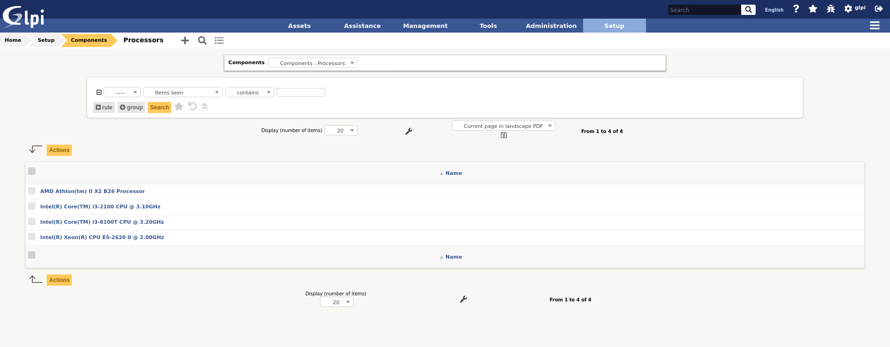
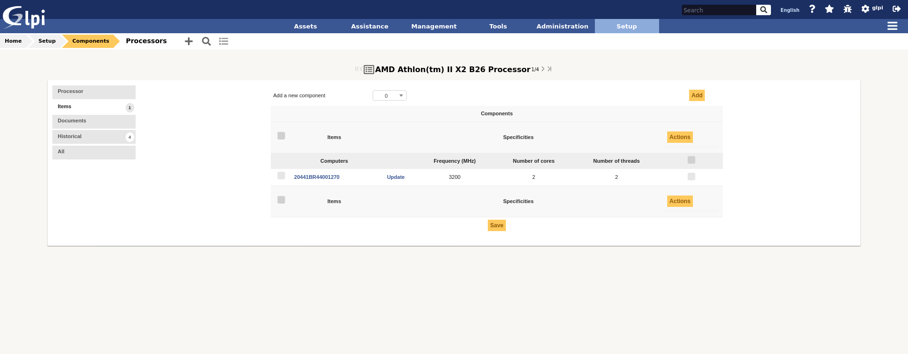

:orphan:

Configurer les composants
=========================

Les composants ajoutés aux ordinateurs sont paramétrables.

Un composant matériel est défini par un type, un nom, un fabricant, un commentaire, ainsi que plusieurs
champs spécifiques au type de composant. Par exemple, pour une carte
mère, on pourra y renseigner le chipset.

La liste des différents types de composant est fixe :

.. image:: images/component_dropdown.png
   :alt: Liste des types de composant
   :align: center

.. note::
   Il est possible de renseigner d'autres types de composants à l'intérieur du type *Autres composants*.
   Il n'est cependant pas possible d'ajouter d'autres types que ceux listés ici.

Une fois un type de composant sélectionné (*Carte mère*, *Processeur*...), on accède automatiquement à la liste
des composants déjà enregistrés.

Les différents onglets
----------------------

Principal
~~~~~~~~~

Informations qui définissent un composant matériel (informations différentes en fonction du type de composant).

Exemple pour un Processeur :

.. image:: images/component_details.png
   :alt: Détail d'un composant de type processeur
   :align: center

Éléments
~~~~~~~~

L'onglet éléments permet de visualiser les ordinateurs liés au composant :

Les informations suivantes seront affichés :

* Nom de l'ordinateur
* La fréquence pour cet ordinateur
* Le nombre de coeurs pour cet ordinateur
* Le nombre de thread pour cet ordinateur

.. note::

   -  **Il est possible de modifier les caractéristiques d'un composant uniquement pour l'élément lié**

      Depuis l'onglet *Eléments* du composant, cliquer sur le lien **Mettre à jour**.

      Plusieurs onglet sont alors proposés :

      *  Onglet "Elément - Lien nom du composant" : liste les caractéristiques de ce composant.
      *  :doc:`Onglet "Gestion" <../parc/onglets/gestion>` : gérer les informations financières et administratives.
      *  :doc:`Onglet "Documents" <../tabs/documents>`
      *  :doc:`Onglet "Historique" <../tabs/historical>`
      *  :doc:`Onglet "Debug" <../tabs/debug>` : uniquement si vous êtes connecté en mode Debug.
      *  :doc:`Onglet "Tous" <../tabs/all>` : pour un élément, toutes les informations sont affichées sur une
         seule page.

.. include:: ../tabs/documents.rst

.. include:: ../tabs/historical.rst

.. include:: ../tabs/all.rst
