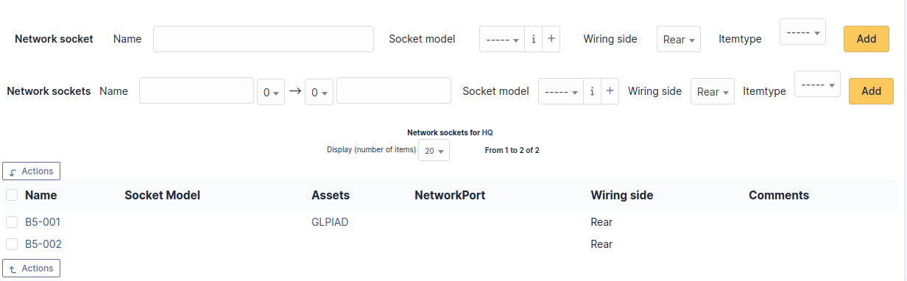

Common
++++++

Locations
---------

The list of locations is organized into a tree structure.
Each location can have sub-locations (Location 1 > Sub-location 1 > Sub-sub-location 1).
It can be delegated by entity.

In the record of a location, there is some information about it including:

* The parent location
* Building number
* Room number
* GPS coordinates (longitude, latitude, altitude)
* Street address

If you allow GLPI to use your location, the map displayed when creating a new location will automatically show your approximate location to help make assigning GPS coordinates easier.

Locations
~~~~~~~~~

Displays a list of locations that are children of the current location and gives an option to add new child locations.

Items
~~~~~

Displays a list of items that have this location assigned to them.
You are able to filter this list by a specific item type (Computers, Monitors, etc).

.. include:: ../../tabs/historical.rst

.. include:: tabs/translation.rst

Sockets
~~~~~~~

Lists the network sockets assigned to this location and allows to add a new one.
In this case, when selecting a socket on a network port of a device, only the available network sockets of the device location (and child locations) are shown.
The addition can be single via the top part or multiple via the bottom part. For adding multiple sockets, you can prefix the socket number as shown in the screenshot.
Another example: considering the prefix `bru`, `9` and `11` the socket numbers and `srv` the suffix; the network sockets created will be named: `bru09srv`, `bru10srv` and `bru11srv`.

.. include:: ../../tabs/all.rst

Status of items
---------------

The list of statuses is organized into a tree structure.
Each status can have sub-locations (Status 1 > Sub-status 1 > Sub-sub-status 1).
It can be delegated by entity.

Statuses of items
~~~~~~~~~~~~~~~~~

Displays a list of statuses that are children of the current status and gives an option to add new child statuses.

.. include:: tabs/translation.rst

.. include:: ../../tabs/all.rst

Manufacturers
-------------

This list is a flat list of values valid for all entities.

This dropdown type cannot be translated.

Blacklists
----------

This list is a flat list of values valid for all entities.

It includes the value you want to blacklist as well as what type to blacklist (IP, MAC, serial number, UUID or email).
Blacklists are used for automatic imports via an inventory agent or by the receiver.

This dropdown type cannot be translated.

.. include:: ../../tabs/historical.rst

.. include:: ../../tabs/all.rst

Blacklisted email content
-------------------------

This list is a flat list of values valid for all entities.

It allows the receiver to not import an email containing the defined text.
This can allow, among other things, to fight against spam in the case of the authorization of ticket creation for anonymous emails.

This dropdown type cannot be translated.