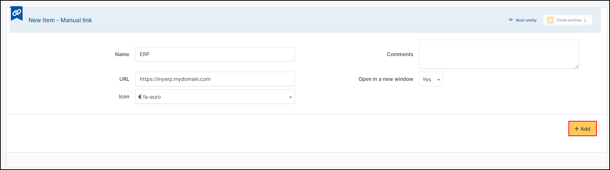
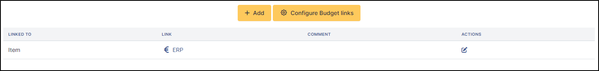
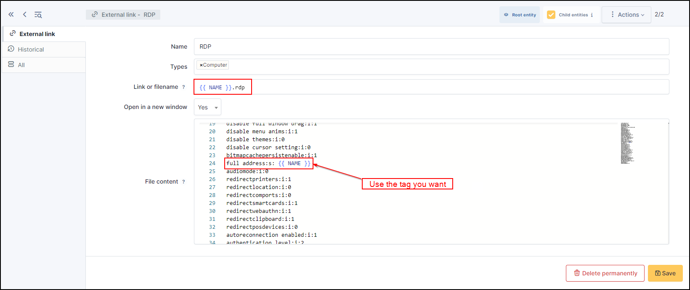

External links
==============

Some elements of GLPI can be associated with a set of links to external applications.
These are visible from the **Links** tab of the various forms.

Add an external link
^^^^^^^^^^^^^^^^^^^^

* Click on **+ Add**
* Enter a **name**
* Enter an **URL**
* Choose your **icon**
* You can choose to open it in a **different tab**

From a GLPI object, select the newly created link so that it appears in the Links tab.

Add an "generic" external link
^^^^^^^^^^^^^^^^^^^^^^^^^^^^^^

You can add a generic link for all elements of a GLPI object.

* In the **links** tab of your objet, click on **Configure XXXXXXXX links** (or go to **Setup** > **External Links**)
* Click on **+ Add**

To setup a link, it is possible to use tags which will be replaced by the values of the element.
External links now use Twig templates. Existing links will be converted automatically during the upgrade to GLPI 11,
but new links need to use Twig syntax. [NAME] -> {{ NAME }}.

The tags are :

============== ==============================================================================================
{{LOGIN}}        The logged in user's username
-------------- ----------------------------------------------------------------------------------------------
{{ID}}           The internal numeric ID for the item
-------------- ----------------------------------------------------------------------------------------------
{{NAME}}        The name of the item
-------------- ----------------------------------------------------------------------------------------------
{{LOCATION}}     The name of the item's location
-------------- ----------------------------------------------------------------------------------------------
{{LOCATIONID}}   The internal numeric ID for the item's location
-------------- ----------------------------------------------------------------------------------------------
{{IP}}           The IP address of the item
-------------- ----------------------------------------------------------------------------------------------
{{MAC}}         The MAC address of the item
-------------- ----------------------------------------------------------------------------------------------
{{NETWORK}}      The item's network
-------------- ----------------------------------------------------------------------------------------------
{{DOMAIN}}      The item's domain. If more than one domain is associated with the item, the first one is used
-------------- ----------------------------------------------------------------------------------------------
{{SERIAL}}       The item's serial number
-------------- ----------------------------------------------------------------------------------------------
{{OTHERSERIAL}}  The item's inventory number/asset tag
-------------- ----------------------------------------------------------------------------------------------
{{USER}}         The item's user
-------------- ----------------------------------------------------------------------------------------------
{{GROUP}}        The item's group
-------------- ----------------------------------------------------------------------------------------------
{{FIRSTNAME}}   The user's first name (Only applies to User external links)
-------------- ----------------------------------------------------------------------------------------------
{{REALNAME}}    The user's surname (Only applies to User external links)
-------------- ----------------------------------------------------------------------------------------------
{{FIELD:*}}    If the field you want is not available as a separate tag,

               it may still be possible to use it by referencing its internal field name

               For example, the comment field would be `{{FIELD:comment}}`

               The field name is case sensitive and typically it will need to be all lowercase.
============== ==============================================================================================

Each link can be associated with one or more element types.

If the content is empty, a simple link will be generated.
If content is present, it is a link to the download of the content that will be generated.

Example
-------

For remote access on computer
~~~~~~~~~~~~~~~~~~~~~~~~~~~~~~

* Create an external protocol link with the name link with the name `{{ NAME }}.rdp`
* Set the **file content** by inserting the content of an RDP type file and replacing the ip / name / domain by TAGS like {{IP}}, {{NAME}}, {{DOMAIN}}.
 (To obtain the contents of an RDP file, open it with a notepad-type tool)

.. note::

    When using tags from network ports (IP, MAC), if the hardware has several, then this will create as many create as many links as there are ports.
    For example, for a machine with 2 different IP addresses, 2 links will be displayed.

A web type link
---------------

Create an external protocol link with the name `https://{{IP}}` and assign it to the network hardware.

Remote control through a VNC extension
--------------------------------------

Some VNC implementations provide an extension that allows to take control of a computer through a browser.
In general, the port used is 5900.
The corresponding link will be of type `https://{{IP}}:5900` or `https://{{NAME}}.{{DOMAIN}}:5900`.
