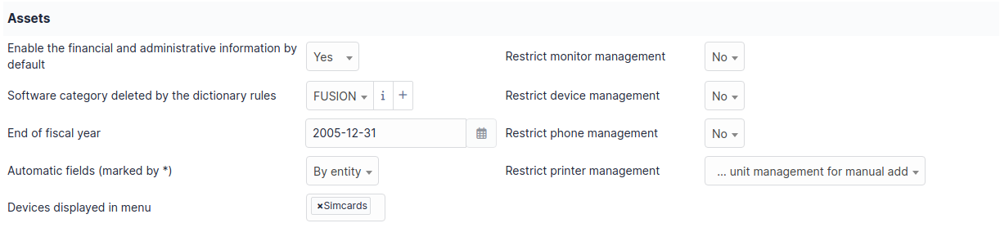
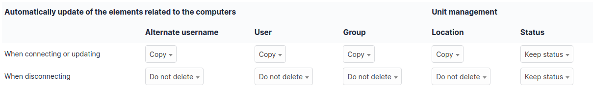

Assets
=======

This tab permit to configure global parameters for inventory.

Assets
------

-  **Enable the financial and administrative information by default**
   Applicable for all objects in the inventory

-  **Software category deleted by the dictionary rules**
   It is possible to automatically change the category of software deleted by dictionary rules.
   By default they are automatically moved to the FUSION category.

-  **End of fiscal year**
   Used in the Management section

-  **Automatic fields (marked by*)**
   When a template is created, it is possible to add automatically generated fields from a template.
   For example, the name of the asset or the inventory number.
   The values of these fields can be incremented either by entity or globally.

-  **Restrict monitor management**
-  **Restrict device management**
-  **Restrict phone management**
-  **Restrict printer management**
   When creating a device manually, the user is asked to choose the type of management (unitary or global).
   A global management only imports an element once, unlike a unitary management which imports it as many times as it is used.
   For example, a printer shared by several users or a monitor connected to a screen switch.
   Subsequently, a unitary managed equipment can be switched to global management mode.
   It is possible to restrict the type of management depending on the equipment.

Automatically update of the elements related to the computers
-------------------------------------------------------------

Interfacing with an inventory tool makes it possible to take an automated inventory of the equipment.
This interfacing is possible through the native inventory feature or a plugin.

-  **When connecting or updating**
   When connecting a device (that is unit managed) directly to a computer, it is possible to have information retrieved from the computer assigned to it such as the User.
-  **When disconnecting**
   When disconnecting a device (that is unit managed) from a computer, it is possible to remove some of the data in the Computer such as the User.

For example, When the inventory is first retrieved, you can define that the monitor connected to the computer will have the status "Production".
Then, when disconnected, it will take the status "Available".