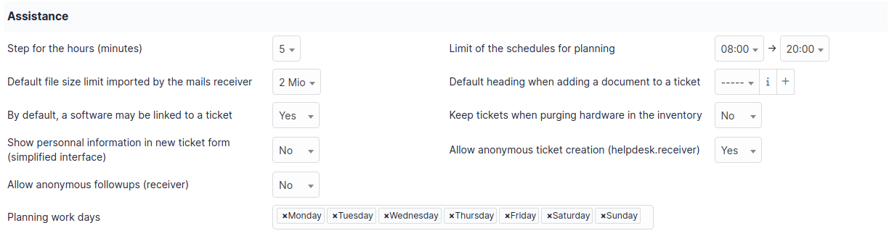

Assistance
==========

This tab allows management of GLPI assistance part.

Assistance
----------

   image

-  **Step for the hours (minutes)**
   Amount of minutes between each step for minutes under an hour in duration dropdowns.
   Example: 5 minutes shows 5, 10, 15, 20, ..., 55, 60.

-  **Default file size limit imported by the mails receiver**
   Maximum size of files to allow to import by the receiver.
   This should be adjusted along with the maximum file size option on the `management tab <management.html>`_ and the `max_upload_size` PHP directive.

-  **Default heading when adding a document to a ticket**
   Allows you to set a default classification for documents uploaded to a ticket.

-  **Keep tickets when purging hardware in the inventory**
   If enabled, the tickets related to an asset being purged will remain.
   Otherwise, they are purged along with the asset.

-  **Allow anonymous ticket creation (helpdesk.receiver)**
   Anonymous ticket creation is disabled by default.
   Activating the option is necessary when using a collector or the anonymous ticket entry form to allow the creation of tickets by users not recognized by GLPI.

-  **Limit of the schedules for planning**
   Time range displayed in the planning screen.

-  **By default, a software may be linked to a ticket**
   Allow associating a software with a ticket by default.

-  **Show personal information in new ticket form (simplified information)**
   Display the name, phone number, and location of the user.
   If needed, the **Edit** button redirects to the main tab of the user's preferences.

-  **Allow anonymous followups (receiver)**
   Allows a user not present in GLPI to respond to an email from GLPI.

Matrix of calculus for priority
-------------------------------

|image| The priority definition matrix allows you to define the priority of tickets according to the level of impact and urgency.
The availability of these levels in the application can also be defined but the Medium level cannot be deleted.

.. |image| image:: /modules/assistance/images/priority_matrix.png

