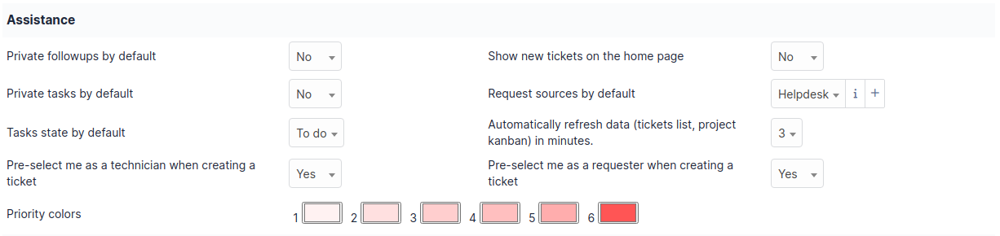
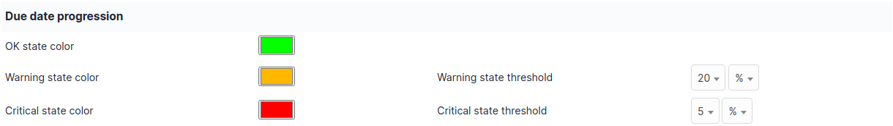
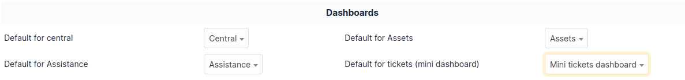

Default values
==============

This tabs allows to configure the display preferences that are used by default.
They can be overridden for each user (see `manage preferences <../../../first-steps/preferences.html>`_).

Personalization
---------------

.. image:: ../images/default_values_personalization.png

-  **Default language**
   The language to use in the GLPI interface

-  **Results to display by page**
   The number of results displayed in the search results list.
   If a user sets this higher than what is specified in the general setup, then they will be limited to the general setup's value.

-  **Display the complete name in tree dropdowns**
   Display the full name of child items in a tree dropdown

-  **Show GLPI ID**
   Adds the GLPI ID after its name on the item's edit form

-  **Notifications for my changes**
   Receive notifications for the actions that the logged in user has done.
   This does not apply to the creation of a ticket for which the notification is systematically sent (proof of creation).

-  **PDF export font**
   The font used when generating PDF exports

-  **Go to created item after creation**
   If enabled, the user would be redirected to the edit from of the item after it gets created.
   Otherwise, they would remain on the new item form to be able to add more items.

-  **Date format**
   Display format for dates

-  **Number format**
   Display format for numbers

-  **Display order of surnames/firstnames**
   Display order for a user's first and last name

-  **Display counters**
   If enabled, the number of elements will be shown next to some tab names such as the `Items` tab in a Ticket.

-  **CSV delimiter**
   Character to delimit fields in a CSV export

-  **Results to display on home page**
   The number of items to display in the Ticket, Change, and Problem tables on the home page.
   If this parameter is set to 0, only the table titles will be displayed but you can access their respective contents by clicking on the name of the table.

-  **Keep devices when purging an item** :
   If enabled, the components linked to an item that is being deleted can be preserved.
   Otherwise, they will be deleted along with the item.

Assistance
----------

-  **Private followups by default**
   If enabled, followups are pre-selected to be private.

-  **Private tasks by default**
   If enabled, tasks are pre-selected to be private.

-  **Tasks state by default**
   Pre-selected state for tasks

-  **Pre-select me as a technician when creating a ticket**
   The logged in user will automatically be assigned to the ticket while creating it.
   This only applies to users who can be assigned to tickets.

-  **Priority colors**
   Define the colors used in the interface to differentiate the different priority levels.

-  **Show new tickets on the home page**
   If the logged in user has the right to see all tickets, a table listing all tickets with the "New" will be displayed in the *Overview* tab of the home page.

-  **Request sources by default**
   Pre-selected request source for new tickets

-  **Automatically refresh data (tickets list, project kanban) in minutes** :
   Automatically refresh the information in the tickets list and Kanban.
   If set to 0, the automatic refresh is disabled.

Due date progression
--------------------

Allows to define the colors that will be applied in the progress bar of an object.
These different states depend on the thresholds set in percent, hours or days.

Dashboards
----------

Configure the default dashboards for the home page (central), assistance module, assets module, and above the tickets search results list.