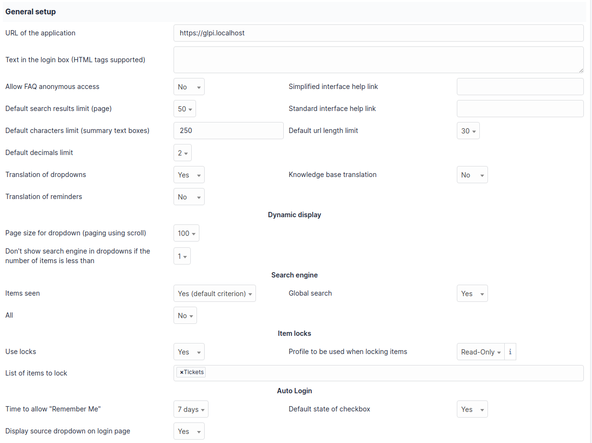

General configuration
=====================

This tab permits to customize main application appearance.

Description of fields
---------------------

* **URL of the application**: used in different links provided in the application, in notifications, and for the API.
  Its defined at install time depending on the URL that has been used for it.
* **Text in the login box**: specific text to be displayed at the top of the login block
* **Allow FAQ anonymous access**: allows :abbr:`Frequently Asked Question <FAQ>` access without any login in GLPI. A link to access the FAQ will be displayed below the login box when enabled.
* **Default search results limit**: maximum number of search results displayed at once on all search pages
* **Default characters limit**: maximum number of displayed characters visible in search results. If you display a ticket content for example, it will be truncated on this number of characters
* **Default url length limit**: same as the above, but applying on URLs
* **Default decimals limit**: number of decimals displayed for amounts
* **Translation of dropdowns**: allows dropdowns do be translated. Once this parameter enabled, a translation tab will be added on dropdown forms (see `dropdowns translations <08_Module_Configuration/02_Intitulés/02_Onglet_Traduction.rst>`_)
* **Translation of reminders**: same as the above, but applying on reminders
* **Knowledge base translation**: same as the above, but applying on knowledge base entries
* **Simplified interface help link**: link to help displayed for users using simplified interface
* **Standard interface help link**: link to help displayed for users using standard interface

* **Page size for dropdown**: number of elements displayed in a dropdown on each scroll
* **Don't show search engine in dropdowns if the number of items is less than**: search in dropdown won't be displayed if there are less results than configured here

* **Items seen**
* **Global search**: enable global search adding a search field at the top of the interface
