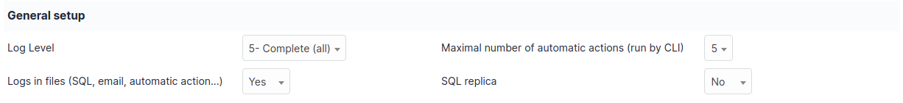
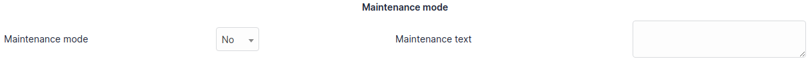
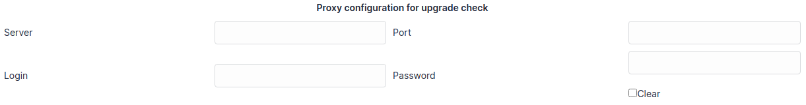
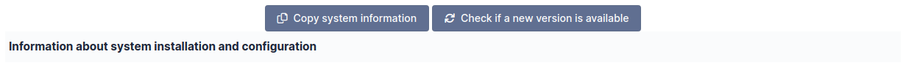

System
======

This tab allows you to view a summary of information about the web server, configure the proxy information, and to define the logging information to be recorded.

-  **Logging level**
   Each internal event of the application is recorded in the logs which are visible in `Administration > Logs <../../administration/logs.html>`_.

-  **Logs in files (SQL, email, automatic action...)** :
   It is possible to record certain additional events (SQL, notifications, automatic action...) in files.
   These files are then available in the `files/\_log` directory.

-  **Maximum number of automatic actions (run by CLI)**
   When configuring automatic actions, it is possible to determine that they will be executed by a system external to GLPI (CLI).
   By default, it executes these actions one by one.
   It possible to increase the number of executions launched simultaneously.

-  **SQL replica**
   Enable to usage of one or more replica databases.
   The replicas can be further configured in the `SQL replicas` tab after this option is enabled.

A maintenance mode can be activated to allow a technical operation such as an update for example.
A maintenance message is configurable and would show on the login page.
In maintenance mode, you can still access GLPI via ``index.php?skipMaintenance=1``.

In the case GLPI sits behind a proxy, it is necessary to indicate the information to allow GLPI to access the Internet.
This affects the checking of new versions, fetching RSS feeds, etc.

The following screen lists all the information of GLPI necessary to report a malfunction to the GLPI development team.
It is preferred to click the `Copy system information` button which will add a rich-text version of the system information tables to your clipboard.
This format shows up in a cleaner format on GitHub than if you copy it directly.