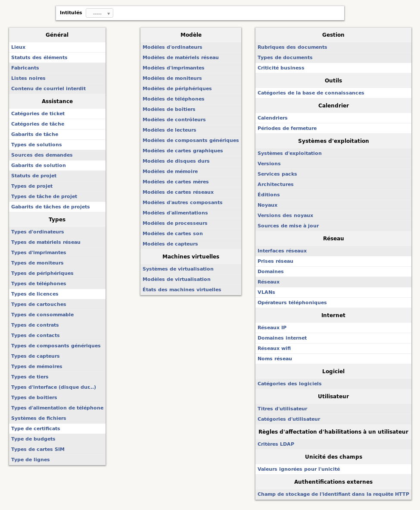

Intitulés
=========

Certaines listes de sélections déroulantes sont paramétrables dans GLPI :

* lieux,
* statuts de matériels,
* catégories de tickets,
* noms des logiciels,
* noms des constructeurs,
* ...

En somme, tout ce qui dépend d'une nomenclature propre à un contexte particulier doit être paramétré. Si certains de ces intitulés sont fournis avec une liste par défaut, la plupart des intitulés doivent être déclarés dans l'application.

Par défaut, les intitulés ne peuvent être traduits dans plusieurs langues. Cette :doc:`fonctionnalité doit être activée </modules/configuration/general/index>`  et permet alors de traduire l'ensemble des champs des intitulés.

Les intitulés sont soit une liste de valeurs à plat (simple liste de valeurs), soit une liste arborescente (chaque élément peut avoir des sous-éléments).

La première étape est de sélectionner la liste à modifier. Ensuite on peut ajouter des éléments à la liste, les modifier et les supprimer.

À chaque intitulé est associé un commentaire. Celui-ci est visible depuis les formulaires de GLPI. Il apparaît au survol de l'icône **Aide** associée à la liste déroulante.

Il est possible de visualiser tous les types d'intitulés existants en utilisant **voir tous**.

Cette liste peut varier suivant les droits accordés dans le profil.
Les intitulés avec fond plus foncé sont des intitulés globaux alors que les autres peuvent être délégués par entité.

.. toctree::
   :maxdepth: 2

   general
   assistance
   calendrier
   internet
   autres
