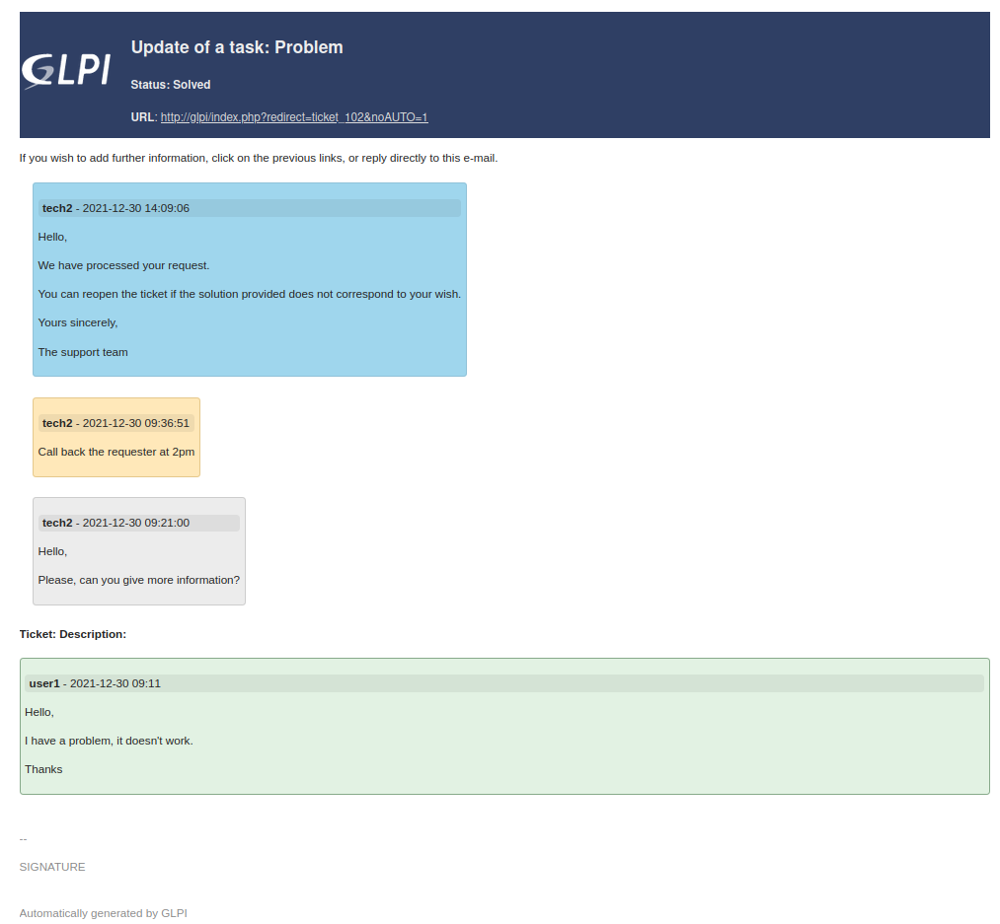

Template example
================

In this example, we will create a template for ticket mail notifications.

In the end, this template can be used for several ticket events:

- New ticket
- Add followup
- Add task
- Resolve ticket
- ...

Create template
---------------

1. Go to **Setup > Notifications > Notification templates**
2. Click on **Add** button
3. Fill in fields

   - **Name**: ``Generic tickets with timeline`` *for example*
   - **Type**: ``Ticket``
   - **Comments**: ``Generic template for tickets, using timeline`` *for example*
   - **CSS**: *leave empty for now*

4. Save to be redirected to the template translation

Basic data
----------

We are now in the editing mode of a template translation.

- **Language**: ``Default translation`` *The minimum required. We will see later how to add other languages.*

- **Subject**: ``##ticket.action##: ##ticket.title##`` *"[GLPI <ticket_number>]" will be automatically added to the email subject*

.. note::
   - ``##ticket.action##``: action that triggered the notification
   - ``##ticket.title##``: ticket title

- **Email text body**: *leave empty to be filled automatically*

- **Email HTML body**: *this is the field that we will mainly modify in the next chapters*

Case: New ticket
----------------

Let's start by adding some basic data.
You can add more by using the "**Show list of available tags**" button to display the available tags.

- **Email HTML body**:

.. code-block:: none

   ##ticket.action##: ##ticket.title##
   ##lang.ticket.status##: ##ticket.status##
   ##lang.ticket.url##: ##ticket.url##

   ##lang.ticket.description##:
   ##ticket.authors## - ##ticket.creationdate##
   ##ticket.description##

.. note::
   - ``##lang.ticket.status##``: text "Status" *automatically translated into the recipient's language*
   - ``##ticket.status##``: ticket status
   - ``##lang.ticket.url##``: text "URL" *automatically translated*
   - ``##ticket.url##``: ticket url
   - ``##lang.ticket.description##``: text "Ticket Description" *automatically translated*
   - ``##ticket.authors##``: ticket requesters *separated by ',' if there is more than one*
   - ``##ticket.creationdate##``: ticket creation date
   - ``##ticket.description##``: ticket description text

Case: Add followup, Add task, Resolve ticket
--------------------------------------------

Follow-ups, tasks and solutions are elements of a ticket's timeline, so we'll loop through "timelineitems" using ``FOREACHtimelineitems``.

- **Email HTML body**:

.. code-block:: none

   ##ticket.action##: ##ticket.title##
   ##lang.ticket.status##: ##ticket.status##
   ##lang.ticket.url##: ##ticket.url##

   ##FOREACHtimelineitems##
    ##timelineitems.author## - ##timelineitems.date##
    ##timelineitems.description##
   ##ENDFOREACHtimelineitems##

   ##lang.ticket.description##:
   ##ticket.authors## - ##ticket.creationdate##
   ##ticket.description##

.. note::
   - ``##FOREACHtimelineitems##``: loop over all timeline items
   - ``##timelineitems.author##``: author of the timeline item
   - ``##timelineitems.date##``: date of the timeline item
   - ``##timelineitems.description##``: description text of the timeline item
   - ``##ENDFOREACHtimelineitems##``: end of the loop

Layout
------

For now, we have only retrieved tags but there is no formatting yet.

Put in bold
~~~~~~~~~~~

   1. Select text : *e.g.* ``##ticket.authors##``
   2. Click on **Bold** button

Clickable link
~~~~~~~~~~~~~~

   1. Select URL text : *e.g.* ``##ticket.url##``
   2. On right-click menu, click on **Link...**
   3. Fill in the field **URL** = ``##ticket.title##``
   4. You can leave the other fields unchanged and **Save**

Add headings
~~~~~~~~~~~~

   1. Select text : *e.g.* ``##ticket.action##: ##ticket.title##``
   2. Click on the **format** drop-down list and select **Headings > Headings 1**

Add a logo
~~~~~~~~~~

   1. Without selecting any text, click on the place where you want to put your image
   2. Click on **Insert image** button
   3. Browse to add your image
   4. If necessary, you can resize via **right-click** menu > **Image...**

Add a table
~~~~~~~~~~~

This table will allow us to display the logo at the same row as the ticket title and its URL.

1. Without selecting any text, click on the place where you want to put your table
2. Click on **Insert table** button
3. The generated table has 2 columns and 2 rows, we only want one row, so delete one:

   1. Right-click on the generated table
   2. Clic on **Row** > **Delete row**

4. Select the previously added image, to drag and drop it into the left cell
5. Select the text of the tags below, to drag and drop it into the right cell

   .. code-block:: none

      ##ticket.action##: ##ticket.title##
      ##lang.ticket.status##: ##ticket.status##
      ##lang.ticket.url##: ##ticket.url##

6. **Right-click** on table > **Table properties**
7. In **Advanced**, click on **Background color** field to select **Dark Blue**
8. Click on **Save** button

Change colors
~~~~~~~~~~~~~

As the background of the table is dark, we will write in white to be more readable.

   1. Select the text in the table
   3. Click on the **Text color** drop-down list and select the color **White**

Add conditional emoticon
~~~~~~~~~~~~~~~~~~~~~~~~

If the ticket is in pending status, we want to display an emoji.

1. Add 2 test tags: ``##IFticket.storestatus=4##`` ``##ENDIFticket.storestatus##``
2. **Right-click** between the 2 tags > **Emoticon**
3. Add emoticon named **Pause button**

Translations
------------

So far, we have only used ``##lang....##`` tags which are automatically translated.
So we could be satisfied with a single translation in the **Default translation** language.

Let's take the case where we have users who only understand one language (English, French or Spanish).
And we want to add a text under the URL that everyone can understand:

- If you wish to add further information, click on the previous links, or reply directly to this e-mail. *English*
- Si vous souhaitez ajouter des informations supplémentaires, cliquez sur les liens précédents, ou répondez directement à cet e-mail. *French*
- Si desea añadir más información, haga clic en los enlaces anteriores, o responda directamente a este correo electrónico. *Spanish*

1. In the **Default translation** we add the English text
2. Remember to **Save**
3. **Right-click** in "Email HTML body" field > **Source code**
4. Select all the code to **copy** it
5. Go back to the template header by clicking on the **Notification templates** value at the top
6. In **Template translations** tab click on **Add a new translation** button
7. Select Language = **Français**
8. **Right-click** in "Email HTML body" field > **Source code**
9. **Paste** the previously copied code
10. **Save** to exit code view
11. Updates the fields:

   - **Subject** = ``##ticket.action##: ##ticket.title##``
   - In **Email HTML body** replace English text with the French text

12. **Save**

Repeat steps 3 to 12 for all useful languages.

Going further with HTML and CSS
-------------------------------

.. warning::
   Part for people already familiar with HTML and CSS.

Everything we have done in the "Email HTML body" field is converted into HTML code which you can edit via **right-click** > **Source code**.
So if you are familiar with HTML, you can edit the code directly. Depending on the case and your skills, this is sometimes easier.

The following code repeats what we did earlier by separating the CSS layout from the HTML and adding colors to the timeline items.
It is not explained, it is just an example.

Code in "Email HTML body" field
~~~~~~~~~~~~~~~~~~~~~~~~~~~~~~~

.. code-block:: html

   <table class="header" border="0">
    <tbody>
     <tr>
      <td class="logo">
       </td>
      <td class="title">
       <h2><strong>##ticket.action##</strong>: ##ticket.title##</h2>
       <h4>##lang.ticket.status##: ##ticket.status## ##IFticket.storestatus=4##⏸##ENDIFticket.storestatus##</h4>
       <strong>##lang.ticket.url##</strong>: <a href="##ticket.url##">##ticket.url##</a>
      </td>
     </tr>
    </tbody>
   </table>
   
If you wish to add further information, click on the previous links, or reply directly to this e-mail.

   
##FOREACH LAST 5 timelineitems##

   

    
<strong>##timelineitems.author##</strong> - ##timelineitems.date##

    
##timelineitems.description##

   

   
##ENDFOREACHtimelineitems##

   <h4>##lang.ticket.description##:</h4>
   

    
<strong>##ticket.authors##</strong> - ##ticket.creationdate##

    
##ticket.description##

   

Code in "CSS" field
~~~~~~~~~~~~~~~~~~~

.. code-block:: CSS

   .header {
      width: 100%;
      background-color: #2f3f64;
      color: #eeeeee;
      border: none;
   }
   .title {
      padding: 10px;
   }
   .title a {
      color: #dddddd;
   }
   .attributes {
      background-color: #1111;
      border-radius: 4px;
      padding: 0 5px;
   }
   .timeline, .request {
      padding: 5px;
      border: thin solid;
      border-radius: 4px;
   }
   .timeline {
      margin: 5px 15px;
      display: inline-block;
   }
   .ITILFollowup {
      background-color: #ececec;
      border-color: #cccccc;
   }
   .TicketTask {
      background-color: #ffe8b9;
      border-color: #e5c88c;
   }
   .ITILSolution {
      background-color: #9fd6ed;
      border-color: #90c2d8;
   }
   .request {
      background-color: #e2f2e3;
      border-color: #87aa8a;
   }
