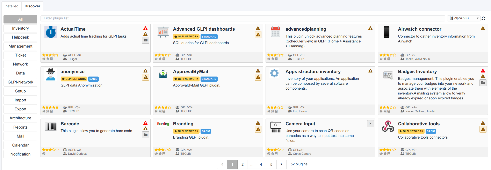

Install and update plugins
==========================

Adding and maintaining extensions (plugins) in GLPI.

.. warning:: Before installing or updating a plugin, it is recommended that you perform a backup of your GLPI database.

Starting in GLPI 9.5.0, you can install and update plugins directly from the GLPI web interface.

The first time you go to the plugins page under `Setup > Plugins`, you will be asked if you want to use the marketplace UI by default or the older plugin list.
Regardless of your choice, you can always switch UIs by clicking the "Marketplace" and "Plugins" buttons at the top of the page.
You may install plugins using both methods. If a plugin is install through the marketplace and manually for some reason, the version installed through the marketplace will be used.

Using the plugin marketplace
----------------------------

To use the marketplace, you will need a GLPI Network registration key. If you are not paying for a GLPI Network subscription, you can still get a free key from `<https://services.glpi-network.com>`_.
After you get the key, you may enter it under `Setup > General` on the `GLPI Network` tab.

Finding plugins
^^^^^^^^^^^^^^^

In the plugin marketplace UI, click on the `Discovery` tab to view the list of all plugins offered through the marketplace.
These include official plugins (free and subscription) and community plugins.
On the left, you can select a category to filter plugins and use the search bar to further limit the results.

Any plugin that has a `GLPI NETWORK` requires a non-free subscription. These plugins will also indicate the tier required such as `BASIC` or `STANDARD`. Each paid tier includes the plugins from the lower tiers.

Installing plugins
^^^^^^^^^^^^^^^^^^

On the right side of each plugin, you should see a button to install it or one or more errors explaining why it cannot be installed.
When you find a plugin available to install, you can click the install button to automatically download the latest version available for your GLPI version and install it.

Plugins installed via the marketplace are stored in the `marketplace` folder in the root of your GLPI instance.

After installation, the install button will change to an enable toggle. You will need to click that button to enable the plugin after installation.

Updating plugins
^^^^^^^^^^^^^^^^

In the marketplace UI on the `Installed` tab, you can see all the plugins currently installed.

Similar to installing plugins, there will be an update button showing if an update is available or one or more errors if there is some issue preventing an update.
Like with installing plugin, you will need to re-enable the plugins after an update.

Manually managing plugins
--------------------------

The main way to discover new plugins is through the `plugin catalog <https://plugins.glpi-project.org>`_.
Each plugin should have a download link that will take you to a GitHub page, the GLPI Network Services website (if it is a subscription-only plugin), or some other page that offers the downloads.

.. note:: A plugin can have several versions and each version usually supports only certain versions of GLPI so be sure to download the version of the plugins that are compatible with your version of GLPI. If you try to install or update a plugin that is not compatible with your GLPI version, it should tell you in the GLPI web interface.

After you download the plugin, you will need to extract it to the `plugins` folder in your GLPI directory. The new folder inside `plugins` should be the "internal" name of the plugin. This is an all lowercase identifier containing no spaces. Inside that folder should be at least two files named `hook.php` and `setup.php`.

Once the plugin is in the `plugins` folder, it will be automatically detected by GLPI and will show up in your plugin list.

All plugins listed will have a group of actions along the right side (or a message indicating why they cannot be installed or updated).
After installing or updating a plugin, you will need to re-enable it.

Uninstalling plugins
--------------------

When you uninstall a plugin using the uninstall button in the plugin list or in the marketplace UI, it does not remove the plugin code and the plugin will still show in the list of plugins to re-install.

To permanently remove the plugin, it is necessary to delete the plugin's folder.
After removing the plugin's folder there should be a new "cleanup" action available for the plugin in GLPI. This will remove the reference to the plugin from the database.