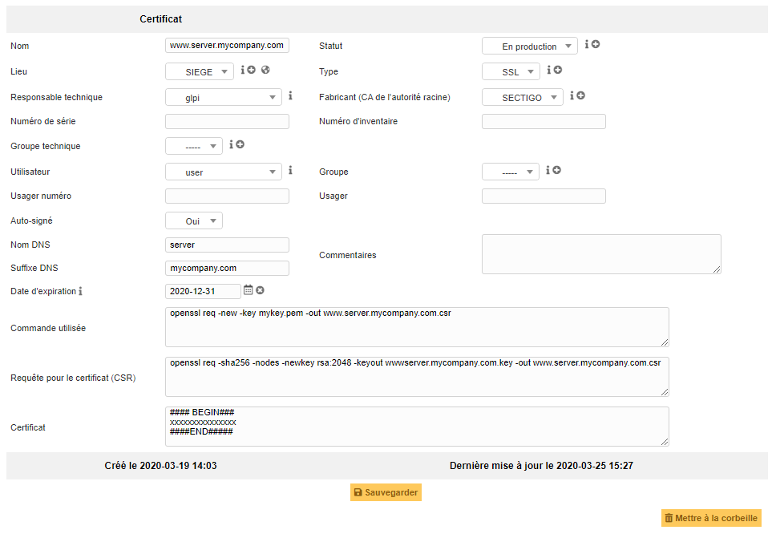

Gérer les certificats
=====================

Au sein de GLPI, il est possible de matérialiser les certificats.

Cette gestion a pour objectif de fournir:

* un inventaire de tous les certificats de l'organisation;

* un suivi des installations de chaque certificat sur les éléments du parc;

* inclure les certificats dans la gestion financière de GLPI;

* anticiper et suivre le renouvellement des certificats.

.. include:: ../onglets/templates.rst

Description des champs spécifiques
----------------------------------

* **Fabricant (CA de l'autorité racine)**: Cette liste déroulante permet de sélectionner et ajouter le fabricant du certificat;
* **Auto-signé**:  Permet d'indiquer si,oui ou non, le certificat actuel est auto-signé;
* **Nom DNS**: Ici est à saisir le préfixe du nom protégé par le certificat. Exemple: server.mycompany.com -> server;
* **Suffixe DNS**: Ici est à saisir le suffixe DNS du nom protégé par le certificat. Exemple: server.mycompany.com -> mycompany.com
* **Date d'expiration**: Permet de définir la fin de validité du certificat. Champ utile pour les alertes GLPI.
* **Commande utilisée**: Ici peut être copier la commande système (CLI) qui a généré le certificat.
* **Requête pour le certificat (CSR)**: Ici peut être copier la commande système (CLI) qui a généré le fichier CSR.
* **Certificat**: Peut être saisi ici, les données contenues dans le fichier CRT (PEM).

Les différents onglets
----------------------

.. include:: ../onglets/elements.rst

.. include:: ../onglets/management.rst

.. include:: ../onglets/contract.rst

.. include:: ../onglets/documents.rst

.. include:: ../onglets/knowledgebase.rst

.. include:: ../onglets/tickets.rst

.. include:: ../onglets/problems.rst

.. include:: ../onglets/changes.rst

.. include:: ../onglets/external-links.rst

.. include:: ../onglets/notes.rst

.. include:: ../onglets/historical.rst

.. include:: ../onglets/all.rst

Les différentes actions
-----------------------
*   :doc:`Ajouter un certificat <../../Les_différentes_actions/creer_un_nouvel_objet>`
*   :doc:`Visualiser un certificat <../../Les_différentes_actions/visualiser_un_objet>`
*   :doc:`Modifier un certificat <../../Les_différentes_actions/modifier_un_objet>`
*   :doc:`Supprimer un certificat <../../Les_différentes_actions/supprimer_un_objet>`
*   :doc:`Associer un document à un certificat <../../Les_différentes_actions/associer_un_document_a_un_objet>`
*   :doc:`Transférer un certificat <../../Les_différentes_actions/transferer_un_objet>`