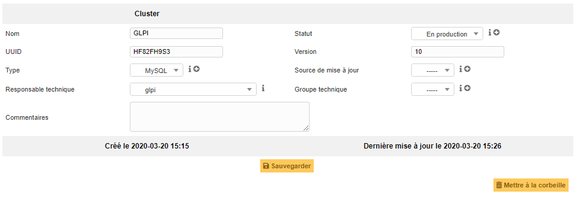
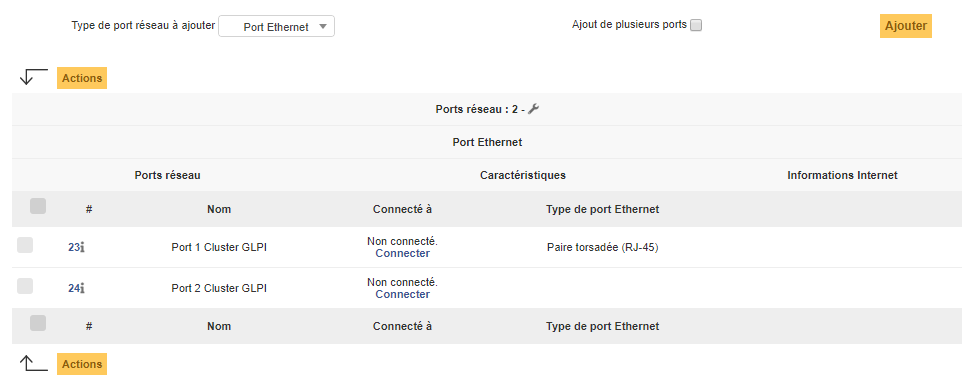

Gérer les clusters
==================

Un Cluster GLPI est un regroupement de plusieurs éléments du parc. Peut rejoindre un cluster, les ordinateurs et les matériels réseau.

.. note::

        Les clusters renseignés dans GLPI sont pris en compte dans l'analyse d'impact !
        TODO : link vers la présentation de l'analyse d'impact

Description des champs spécifiques
----------------------------------

* **UUID**: Identifiant unique du cluster
* **Version**: Dans le cas d'un cluster logiciel ou autre, la version peut être indiquée
* **Source de mise à jour**: Ce champ représente la manière dont la fiche de l'objet dans GLPI a été mise à jour

Les différents onglets
----------------------

Eléments
~~~~~~~~

Cet onglet liste et pemret l'ajout d'un ou plusieurs éléments du parc au sein du cluster.

.. image:: images/elements-clusters.png
        :alt: Liste et ajout des membres du cluster
        :align: center

Ports réseau
~~~~~~~~~~~~

Cet onglet permet de créer et de lister des interfaces réseau propres au cluster. 

Les interfaces possibles:

* Port Ethernet
* Ports Wifi
* Agrégation de port
* Alias de port
* Connexion par ligne commutée - Dialup
* Boucle locale
* Port Fibre Channel

.. include:: ../onglets/contract.rst

.. include:: ../onglets/documents.rst

.. include:: ../onglets/tickets.rst

.. include:: ../onglets/problems.rst

.. include:: ../onglets/changes.rst

.. include:: ../onglets/historical.rst

.. include:: ../onglets/all.rst

Les différentes actions
-----------------------
*   :doc:`Ajouter un cluster <../../Les_différentes_actions/creer_un_nouvel_objet>`
*   :doc:`Visualiser un cluster <../../Les_différentes_actions/visualiser_un_objet>`
*   :doc:`Modifier un cluster <../../Les_différentes_actions/modifier_un_objet>`
*   :doc:`Supprimer un cluster <../../Les_différentes_actions/supprimer_un_objet>`
*   :doc:`Associer un document à un cluster <../../Les_différentes_actions/associer_un_document_a_un_objet>`
*   :doc:`Transférer un cluster <../../Les_différentes_actions/transferer_un_objet>`
