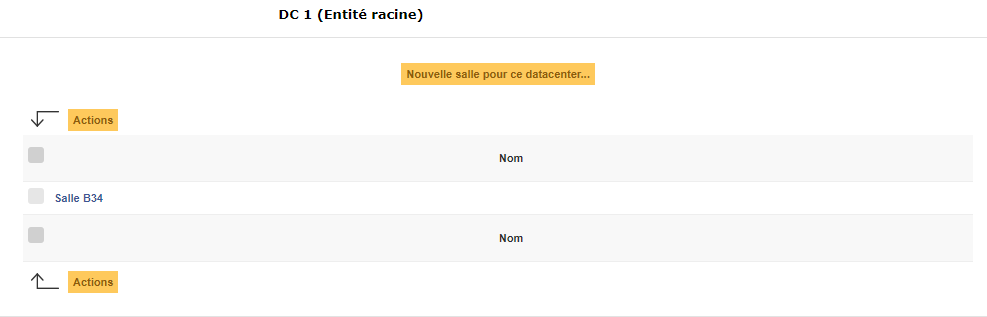

Gérer les centres de données
============================

GLPI permet la gestion des centres de données et plus précisément la gestion des salles serveurs et des baies informatiques qui les composent.

Cette gestion a pour objectif de fournir:

* Un inventaire des centres, salles et baies informatiques de l'organisation;
* tous les autres modules au service des centres, salles et baies (notamment le module Parc qui permet une réprésentation graphique détaillées des baies);
* la possibilité d'inclure ces objets dans la gestion financière de GLPI.

Centre de données
-----------------

Le centre de données en lui même est un objet très simpliste dans GLPI. Il se matérialise sous la forme d'un nom et d'un lieu et permet uniquement de regrouper des salles serveurs.

.. image:: images/data-centers.png
		:alt: Caractérsation d'un centre de données
		:align: center

Les différents onglets
~~~~~~~~~~~~~~~~~~~~~~

Salles serveurs
~~~~~~~~~~~~~~~

Cet onglet liste les salles serveurs attachées au centre de données actuel et permet également d'en ajouter.

.. include:: ../onglets/all.rst

Salle Serveur 
-------------

Une salle serveur dans GLPI se matérialise sour forme d'un plan schématique. Ce plan réprésentera l'espace disponible dans la salle de la serveur. Cet espace sera utilisé pour y définir et placer les objets Baies de GLPI.

La salle serveur est associable à un centre de données et un lieu.

.. image:: images/servers-room.png
        :alt: Définition d'une salle serveur
        :align: center

.. note::

        Le plan sera une grille définie par un nombre de colonnes et de lignes.
        1 Baie consomme 1 case.
        
        L'arrière plan peut grandement aider à la visualisation de la salle, notamment si celui ci a été généré avec un outil adapté à la représentation d'espace.

Les différents onglets
~~~~~~~~~~~~~~~~~~~~~~

Baies
~~~~~

Cet onglet permet de consulter et d'agir sur le plan de la salle serveur. Pourront être ajoutées directement sur le plan, les différentes baies informatiques qui composent la salle.

Si beaucoup d'éléments sont présents, il est possible de passer sur une vue en mode liste.

.. image:: images/plan-servers-room.png
        :alt: Plan représentatif d'une salle serveur
        :align: center

Analyse d'impact
~~~~~~~~~~~~~~~~

Cet onglet permet de consulter et de construire le schéma d'impact du point de vue de l'objet.

.. image:: images/impact-datacenters.png

.. include:: ../onglets/management.rst

.. include:: ../onglets/contract.rst

.. include:: ../onglets/documents.rst

.. include:: ../onglets/external-links.rst

.. include:: ../onglets/tickets.rst

.. include:: ../onglets/problems.rst

.. include:: ../onglets/changes.rst

.. include:: ../onglets/historical.rst

.. include:: ../onglets/all.rst

Les différentes actions
-----------------------
*   :doc:`Ajouter un centre de données <../../Les_différentes_actions/creer_un_nouvel_objet>`
*   :doc:`Visualiser un centre de données <../../Les_différentes_actions/visualiser_un_objet>`
*   :doc:`Modifier un centre de données <../../Les_différentes_actions/modifier_un_objet>`
*   :doc:`Supprimer un centre de données <../../Les_différentes_actions/supprimer_un_objet>`
*   :doc:`Associer un document à un centre de données <../../Les_différentes_actions/associer_un_document_a_un_objet>`
*   :doc:`Transférer un centre de données <../../Les_différentes_actions/transferer_un_objet>`
*   :doc:`Visualier la liste des salles serveurs <../../Les_différentes_actions/visualiser_liste_ salles_serveurs>`

