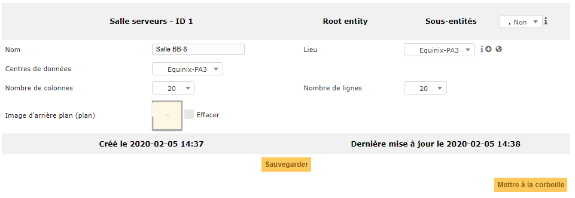

Gérer les centres de données
============================

GLPI permet la gestion des centres de données et plus précisément la gestion des salles serveurs et des baies informatiques qui les composent.

Cette gestion a pour objectif de fournir:

- Un inventaire des centres, salles et baies informatiques de l'organisation;
- tous les autres modules au service des centres, salles et baies (notamment le module Parc qui permet une réprésentation graphique détaillées des baies);
- la possibilité d'inclure ces objets dans la gestion financière de GLPI.

Les différents onglets (salle serveur)
--------------------------------------

Salle serveurs
~~~~~~~~~~~~~~

L'onglet principal d'une salle serveurs. Dans celui, il pourra être défini le nom, le lieu et le centre de données dans lequel la salle se trouve.

En liaison avec l'onglet suivant, c'est ici que pourra être également défini la taille du plan ainsi qu'une image d'arrière plan pour ce dernier.

.. note::

        Le plan sera une grille définie par un nombre de colonnes et de lignes.
        Il est d'usage de dire qu'une case = 1m carré, car l'objet Baie consomme 1 case.
        
        L'arrière plan peut grandement aider à la visualisation de la salle, notamment si celui ci a été généré avec un outil adapté à la représentation de salle.

Baies
~~~~~

Cet onglet permet d'obtenir le plan graphique conçu dans l'onglet précédent. Pourront être ajoutées directement sur le plan, les différentes baies informatiques qui composent la salle.

Si beaucoup d'éléments sont présents, il est possible de passer sur une vue en mode liste.

.. image:: images/plan-servers-room.png
        :alt: Plan représentatif d'une salle serveur
        :align: center

Analyse d'impact
~~~~~~~~~~~~~~~~

Cet onglet permet de consulter et de construire le schéma d'impact du point de vue de l'objet.

.. image:: images/impact-datacenters.png

.. include:: ../onglets/management.rst

.. include:: ../onglets/contract.rst

.. include:: ../onglets/documents.rst

.. include:: ../onglets/external-links.rst

.. include:: ../onglets/tickets.rst

.. include:: ../onglets/problems.rst

.. include:: ../onglets/changes.rst

.. include:: ../onglets/historical.rst

.. include:: ../onglets/all.rst

