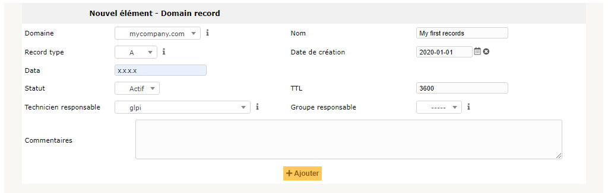

Gérer les domaines
==================

Gérer les domaines au sein de GLPI permet notamment:

- de construire un inventaire des noms de domaines;
- d'inventorier les enregistrements (records) de chaque domaine;
- d'anticiper et suivre le renouvellement des noms de domaines;
- d'intégrer les domaines dans la gestion financière de GLPI;
- inclure les domaines dans l'assistance de GLPI.

.. image:: images/domains.png
        :alt: Caractérisation d'un domaine
        :align: center

Les différents onglets
----------------------

Records
~~~~~~~

Dans cet onglet, il est possible de sélectionner ou de créer un enregistrement de domaine à associer au domaine actuel.

.. image:: images/recordslist-domains.png
        :alt: Liste des enregistrements associables
        :align: center

.. note::

        Les types d'enregistrements ne sont pas limités à ceux créés par défaut, ils sont personnalisables depuis la gestion des intitulés !

.. include:: ../onglets/elements.rst

.. include:: ../onglets/management.rst

.. include:: ../onglets/tickets.rst

.. include:: ../onglets/problems.rst

.. include:: ../onglets/changes.rst

.. include:: ../onglets/contract/rst

.. include:: ../onglets/documents.rst

.. include:: ../onglets/external-links.rst

.. include:: ../onglets/historical.rst

.. include:: ../onglets/all.rst

Les différentes actions
-----------------------

-   :doc:`Ajouter un domaine <../../Les_différentes_actions/creer_un_nouvel_objet>`

-   :doc:`Visualiser un domaine <../../Les_différentes_actions/visualiser_un_objet>`

-   :doc:`Modifier un domaine <../../Les_différentes_actions/modifier_un_objet>`

-   :doc:`Supprimer un domaine <../../Les_différentes_actions/supprimer_un_objet>`

-   :doc:`Associer un document à un domaine <../../Les_différentes_actions/associer_un_document_a_un_objet>`

-   :doc:`Transférer un domaine <../../Les_différentes_actions/transferer_un_objet>`