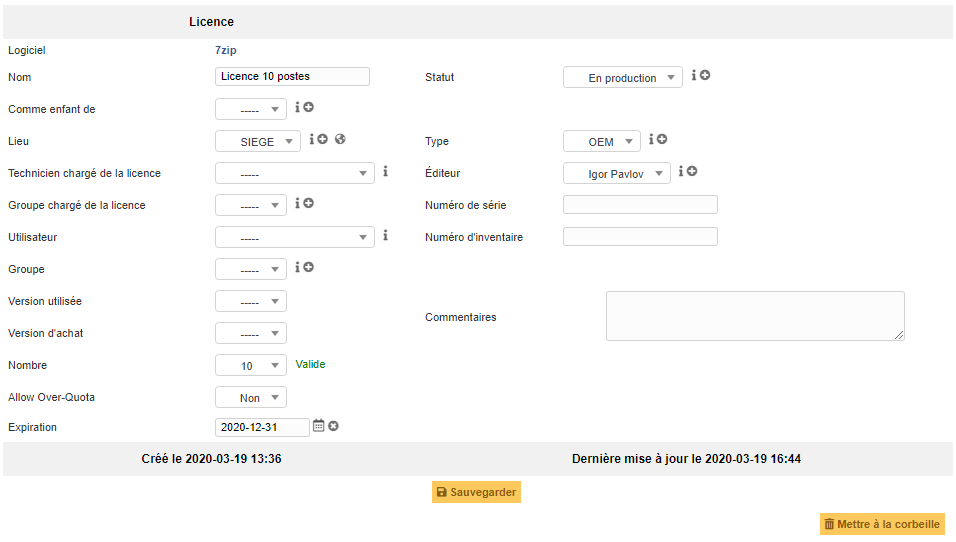
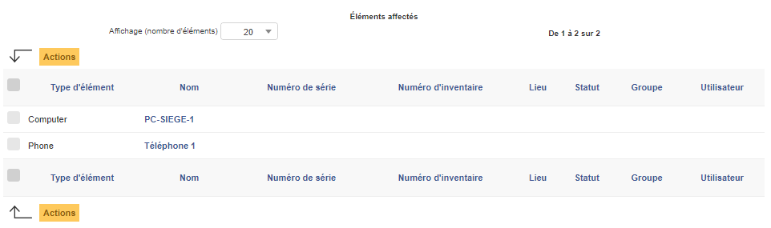

Gérer les licences
==================

Au sein de GLPI, il est possible de matérialiser les licences logiciels.

Cette gestion a pour objectif de fournir:

* un inventaire des licences en lien avec les logiciels déjà inventoriés dans GLPI;
* un suivi des installations de chaque licence sur les éléments du parc;
* inclure les licences dans la gestion financière de GLPI;
* anticiper et suivre le renouvellement des licences.

.. note:: 
        
        Une licence ne peut pas exister au sein de GLPI sans un logiciel associé à sa création.

        La gestion de licence reste statique, un suivi humain est nécessaire afin d'assurer l'actualisation des informations.

.. include:: ../tabs/templates.rst

Description des champs spécifiques
----------------------------------
* **Comme enfant de**: Permet d'indiquer si la licence est dépendante d'une autre;
* **Version utilisée**: C'est la version du logiciel qui sera associée à la licence;
* **Version d'achat**: La version d'achat peut différer de la version actuellement utilisée, il est possible de l'indiquer ici;
* **Nombre**: Ici pourra être indiqué le nombre de lien possibles entre la licence et les matériels dans GLPI;
* **Autoriser la surconsommation (Allow Over-Quota)**: Permet d'autoriser ou non le dépassement du nombre de lien maximum configuré dans le champ Nombre;
* **Expiration**: La date de fin de validité de la licence. Champ utile pour configurer les alertes et anticiper le renouvellement.

Les différents onglets
----------------------

Licences
~~~~~~~~

Cet onglet liste toutes les licences considérées comme enfant de la licence actuelle.

.. note:: 

        Certaines licences peuvent s'obtenir par pack ou par groupe de licence (pour un lieu spécifique par exemple), il est donc intéressant de les lier.

.. image:: images/child-licenses.png
        :alt: Liste des licences filles
        :align: center

Résumé
~~~~~~

Cet onglet liste tous les types et les entités des éléments du parc concernés par cette licence.

.. note::

        Attention au nombre d'installation/licence disponible défini dans le champ Nombre de la licence.
        
        La création du lien entre un élément du parc et la licence se fait dans l'onglet Logiciels de l'élément.

.. image:: images/resume-licenses.png
        :alt: Liste des types d'éléments concernés par la licence.
        :align: center

Eléments
~~~~~~~~

Cet onglet liste précisément chaque élément relié à la licence actuelle.

.. include:: ../tabs/management.rst

.. include:: ../tabs/contract.rst

.. include:: ../tabs/documents.rst

.. include:: ../tabs/knowledgebase.rst

.. include:: ../tabs/tickets.rst

.. include:: ../tabs/problems.rst

.. include:: ../tabs/changes.rst

.. include:: ../tabs/notes.rst

Certificats
~~~~~~~~~~~

Dans cet onglet, il est possible d'associer un certificat, présent dans GLPI, à une licence.

.. image:: images/certificates-licenses.png

.. include:: ../tabs/historical.rst

.. include:: ../tabs/all.rst

Les différentes actions
-----------------------

*   :doc:`Ajouter une licence <../../Les_différentes_actions/creer_un_nouvel_objet>`
*   :doc:`Visualiser une licence <../../Les_différentes_actions/visualiser_un_objet>`
*   :doc:`Modifier une licence <../../Les_différentes_actions/modifier_un_objet>`
*   :doc:`Supprimer une licence <../../Les_différentes_actions/supprimer_un_objet>`
*   :doc:`Associer un document à une licence <../../Les_différentes_actions/associer_un_document_a_un_objet>`
*   :doc:`Transférer une licence <../../Les_différentes_actions/transferer_un_objet>`