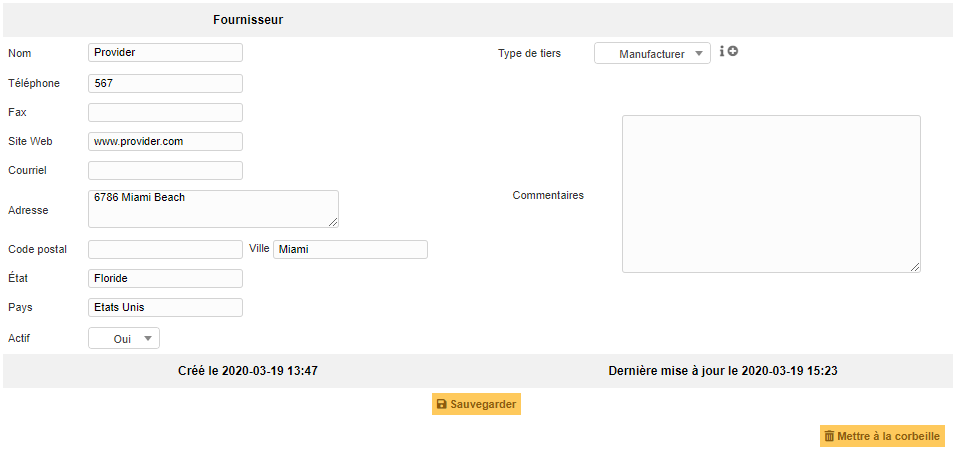
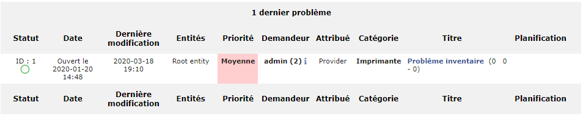

Gérer les fournisseurs
======================

GLPI intègre une gestion des fournisseurs, celle-ci sert à la fois à identifier qui a vendu un matériel (dans la gestion de parc) mais aussi à attribuer des tickets à cette personne ou société.

Lors de l'achat d'un matériel de marque XX à un fournisseur YY, il faut traiter deux informations distinctes à savoir le fabricant (XX) et le fournisseur (YY).

Un fournisseur se caractérise par un nom, un type de tiers (intitulé), des informations de localisation (adresse, code postal, ville, pays) et de contact (site web, téléphone et fax).

Cette gestion à pour objectif, notamment:

* de référencer tous les fournisseurs relatifs au parc informatique de l'organisation;
* d'optimiser le contact en cas d'incident;
* de permettre d'inclure les fournisseurs dans l'Assistance de GLPI.

Les différents onglets
----------------------

.. include:: ../tabs/contacts.rst

.. note::
        La distinction est clairement établie entre le fournisseur, qu'il est possible de lier de manière univoque à des éléments d'inventaire et les contacts, qui composent la liste des personnes permettant d'entrer en relation avec ce fournisseur. Pour établir cette liste, il faut donc associer les contacts au fournisseur concerné.

        Exemple :

        Monsieur Dupont est conseiller de vente dans l'entreprise Acme auprès de qui la structure se fournit régulièrement.
        Créer un fournisseur nommé Acme.
        Créer un contact au nom de Monsieur Dupont.
        Affecter à ce contact le type commercial.
        Puis associer le contact au fournisseur Acme.

.. include:: ../tabs/contracts.rst

Eléments associés
~~~~~~~~~~~~~~~~~

L'onglet Eléments pour l'objet fournisseur est spécifique. Il ne permet que la consultation.
Lier un élément avec un fournissur se fera depuis l'onglet **Gestion** de l'élément (du Parc) concerné.

.. image:: images/elements-suppliers.png
        :alt: Consultation des éléments liés à un fournisseur
        :align: center

.. include:: ../tabs/documents.rst

.. include:: ../tabs/tickets.rst

Problèmes
~~~~~~~~~

Dans cet onglet, il sera possible de consulter les **Problèmes** associés à ce fournisseur. C'est à dire, tous les Problèmes sur lesquels le fournisseur est affecté dans le champ **Attribué à**.

Changements
~~~~~~~~~~~

L'onglet permet la consultation de tous les Changements sur lesquels le fournisseur est affecté dans le champ **Attribué à**.

.. image:: images/changes-suppliers.png
        :alt: Consultation des Changements associés à un fournisseur
        :align: center

.. include:: ../tabs/external-links.rst

.. include:: ../tabs/notes.rst

.. include:: ../tabs/knowledgebase.rst

.. include:: ../tabs/historical.rst

.. include:: ../tabs/all.rst

Les différentes actions
-----------------------

*   :doc:`Ajouter un fournisseur <../../Les_différentes_actions/creer_un_nouvel_objet>`
*   :doc:`Visualiser un fournisseur <../../Les_différentes_actions/visualiser_un_objet>`
*   :doc:`Modifier un fournisseur <../../Les_différentes_actions/modifier_un_objet>`
*   :doc:`Supprimer un fournisseur <../../Les_différentes_actions/supprimer_un_objet>`
*   :doc:`Associer un document à un fournisseur <../../Les_différentes_actions/associer_un_document_a_un_objet>`
*   :doc:`Transférer un fournisseur <../../Les_différentes_actions/transferer_un_objet>`