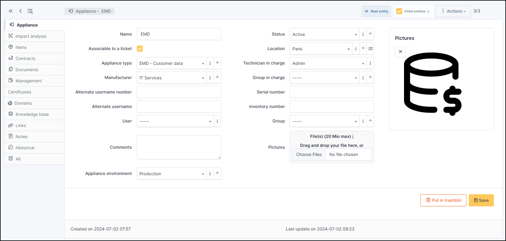
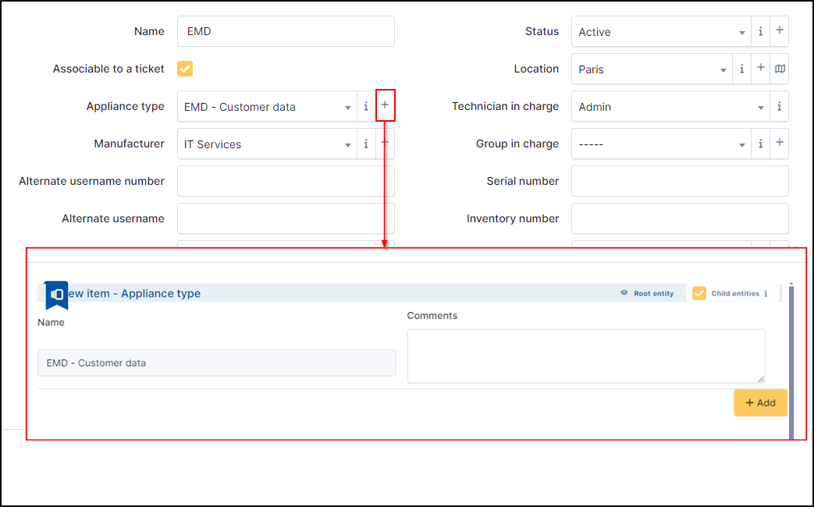

Appliances
==========

The Appliances in GLPI refer to the software and applications managed within the GLPI tool. This includes all software solutions installed on users' machines,
servers and other devices within the organisation.
Applications can include office applications, business software, operating systems, utilities, etc.

The basics fields
-----------------

* Name
* :doc:`Status </tabs/common_fields/status>`
* :doc:`Location </tabs/common_fields/location>`
* :doc:`Technician in charge </tabs/common_fields/technician_in_charge>`
* :doc:`Group in charge </tabs/common_fields/group_in_charge>`
* :doc:`Manufacturer </tabs/common_fields/manufacturer>`
* :doc:`Alternate username number </tabs/common_fields/alternate_username>`
* :doc:`Alternate username </tabs/common_fields/alternate_user>`
* :doc:`Serial number </tabs/common_fields/serial_number>`
* :doc:`Inventory number </tabs/common_fields/inventory_number>`
* :doc:`User </tabs/common_fields/user>`
* :doc:`Group </tabs/common_fields/group>`
* :doc:`Comments </tabs/common_fields/comments>`

The specifics fields
--------------------

Appliance type
~~~~~~~~~~~~~~

The appliance type is used to define the appliance context (VOIP, EDM, etc.).
You can select the type of application from the drop-down list, or add a new one directly by clicking on the **+**.

Appliance environment
~~~~~~~~~~~~~~~~~~~~~

The application environment designates whether the application is in production, acceptance, pre-production, etc.
This field can of course be adapted to suit your needs.

Pictures
~~~~~~~~

You can add a picture for your appliance.

The differents tab
------------------

Impact Analysis
~~~~~~~~~~~~~~~

:doc:`Impact analysis </tabs/impact_analysis>` enables an infrastructure diagram to be drawn up, showing the dependencies and impacts in the event of equipment loss.
This can be saved and exported

Items
~~~~~

List of all other linked GLPI :doc:`Items </tabs/item>`. You can manually add an item by selecting it from the drop-down list.
An appliance can also be linked to another appliance

Contracts
~~~~~~~~~

GLPI supports :doc:`contracts management </modules/management/contract>`, in order to manage contract types such as loan, maintenance, support…

Contracts management allows to:

* make an inventory of all contracts related to the organization assets
* integrate contracts in GLPI financial management
* anticipate and follow contract renewal.

Documents
~~~~~~~~~

The :doc:`document </modules/management/documents>` tab lets you link different types of file to a material (PDF, txt, png, etc.)
You can attach a document already uploaded to GLPI or add a new one directly from this tab.

Management
~~~~~~~~~~

:doc:`Management </modules/tabs/management>` of financial and administrative information,
this information is visible in the ‘Management’ tab on the object form.

Certificates
~~~~~~~~~~~~

Link a :doc:`certificate </modules/management/certificates>` to your registration. You can manage certificates in **Management** > **Certificates**

Domains
~~~~~~~

:doc:`Domains </modules/management/domains>` represents an Internet domain, with its name, expiration date...
This object can itself be linked to other objects in GLPI support (tickets, problems, changes).

Knowledge Base
~~~~~~~~~~~~~~

Lists all the articles in the :doc:`knowledge base <../tabs/knowledgebase>` relating to the appliance.

Links
~~~~~

:doc:`Links <../configuration/external_links>` offer several possibilities.
Send the GLPI object file to another URL of your choice, or generate an RDP file, for example.

Note
~~~~

The :doc:`Notes </modules/tabs/notes>` tab provides a free text field for storing additional information.
Notes are displayed in the order of their creation. You can also add a document

.. include:: ../tabs/historical.rst

.. include:: ../tabs/all.rst