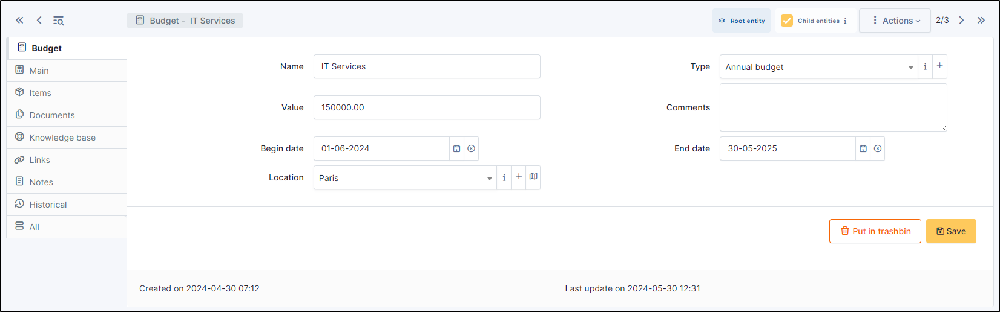

Budgets
=======

A budget in GLPI is defined by an amount and a time period. Other GLPI items can be attached to this budget and will then, by providing their value, modify the budget available amount.

Creating a budget in GLPI enables the administrative and financial management functionality for all other GLPI items.

It is possible to follow the evolution of a budget by tracing the value of each attached item.

.. note::

   Attaching a GLPI item to a budget is done via tab `Management` of the item!

.. note::

   When displaying a budget from a sub-entity, the budget remaining total amount is not visible.

   The budget remaining total amount can be negative if the sum of the values of attached items is greater than the budget amount.

.. include:: ../tabs/templates.rst

The different tabs
------------------

Main tab
~~~~~~~~

This tab provides a summary table giving the expended amount of the budget, sorted by item type, as well as total remaining amount.

.. image:: images/main-budgets.png
   :alt: Budget summary table
   :align: center

Items
~~~~~

This tab displays GLPI items attached to this budget as well as their value.

.. image:: images/elements-budgets.png
   :alt: Budget attached elements
   :align: center

.. note::

   Attaching a GLPI item to a budget is done via tab `Management` of the item!

.. include:: ../tabs/documents.rst

.. include:: ../tabs/knowledgebase.rst

.. include:: ../tabs/external-links.rst

.. include:: ../tabs/notes.rst

.. include:: ../tabs/historical.rst

.. include:: ../tabs/all.rst

The different actions
---------------------

* :doc:`Add a budget <../../Les_différentes_actions/creer_un_nouvel_objet>`
* :doc:`Display a budget <../../Les_différentes_actions/visualiser_un_objet>`
* :doc:`Modify a budget <../../Les_différentes_actions/modifier_un_objet>`
* :doc:`Delete a budget <../../Les_différentes_actions/supprimer_un_objet>`
* :doc:`Attach a document to a budget <../../Les_différentes_actions/associer_un_document_a_un_objet>`
* :doc:`Transfer a budget <../../Les_différentes_actions/transferer_un_objet>`
