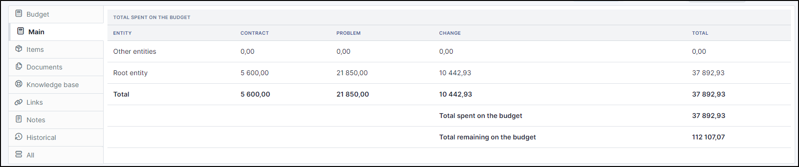
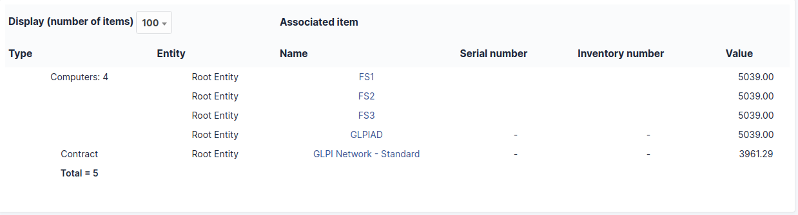

Budgets
=======

A budget in GLPI is defined by an amount and a time period. Other GLPI items can be attached to this budget and will then, by providing their value, modify the budget available amount.

Creating a budget in GLPI enables the administrative and financial management functionality for all other GLPI items.

It is possible to follow the evolution of a budget by tracing the value of each attached item.

.. note::

   Attaching a GLPI item to a budget is done via tab `Management` of the item!

.. note::

   When displaying a budget from a sub-entity, the budget remaining total amount is not visible.

   The budget remaining total amount can be negative if the sum of the values of attached items is greater than the budget amount.

.. include:: ../tabs/templates.rst

Add a new budget
----------------

* To add a new budget, click on **+ Add** at the top of the screen
* Enter the information required
   .. image:: images/budgets.png
      :alt: Main fields of a budget
      :align: center
      :scale: 42%
* You can add a budget type (administrative value)
   .. image:: images/budgets-type.png
      :alt: Main fields of a budget
      :align: center
      :scale: 36%

.. tip:: You can manage your budget type in **Setup** > **Dropdowns** > **Types** > **Budget types**

The different tabs
------------------

Main tab
~~~~~~~~

This tab provides a summary table giving the expended amount of the budget, sorted by item type, as well as total remaining amount.
You cannot add a cost directly from this tab. Costs are deducted via the tabs of the same name in the various GLPI objects (changes, tickets, etc).

Items
~~~~~

This tab displays GLPI items attached to this budget as well as their value.

.. note::

   Attaching a GLPI item to a budget is done via tab `Management` of the item!

.. include:: ../tabs/documents.rst

.. include:: ../tabs/knowledgebase.rst

.. include:: ../tabs/external-links.rst

.. include:: ../tabs/notes.rst

.. include:: ../tabs/historical.rst

.. include:: ../tabs/all.rst
