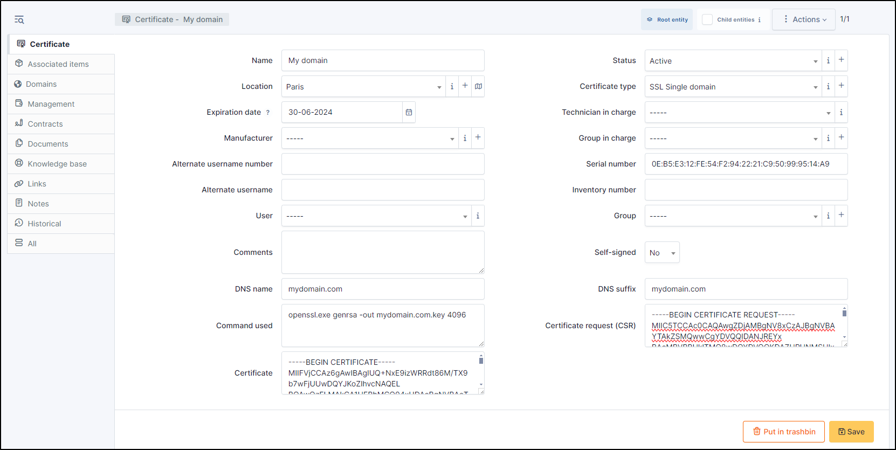

Certificates
============

Certificates management in GLPI allows to:

* Create an inventory of all organization certificates;
* Follow installation of certificates on assets;
* Include certificates in GLPI financial management;
* Anticipate and follow certificates renewal.

.. include:: ../tabs/templates.rst

Description of specific fields
------------------------------

* **Manufacturer (Root CA)**: This drop-down list allow to select certificate manufacturer;
* **Self-signed**: Tells whether certificate is self-signed;
* **DNS name**: The prefix of the domain name associated with the certificate (for example, if domain name is `server.mycompany.com`, DNS name is `server`);
* **DNS suffix**: The suffix of the domain name associated with the certificate (for example, if domain name is `server.mycompany.com`, DNS suffix is `mycompany.com`);
* **Expiration date**: Expiration date of the certificate, useful to configure alerts and anticipate renewal;
* **Command used**: Can store the system command that generated the certificate;
* **Certificate Request (CSR)**: Can store the system command that generated the CSR file;
* **Certificate**: Can store the data contained in the CRT file (PEM).

The different tabs
------------------

.. include:: ../tabs/elements.rst

.. include:: ../tabs/management.rst

.. include:: ../tabs/contracts.rst

.. include:: ../tabs/documents.rst

.. include:: ../tabs/knowledgebase.rst

.. include:: ../tabs/tickets.rst

.. include:: ../tabs/problems.rst

.. include:: ../tabs/changes.rst

.. include:: ../tabs/external-links.rst

.. include:: ../tabs/notes.rst

.. include:: ../tabs/historical.rst

.. include:: ../tabs/all.rst

The different actions
---------------------

*   :doc:`Add a certificate <../../Les_différentes_actions/creer_un_nouvel_objet>`
*   :doc:`Display a certificate <../../Les_différentes_actions/visualiser_un_objet>`
*   :doc:`Modify a certificate <../../Les_différentes_actions/modifier_un_objet>`
*   :doc:`Delete a certificate <../../Les_différentes_actions/supprimer_un_objet>`
*   :doc:`Attach a document to a certificate <../../Les_différentes_actions/associer_un_document_a_un_objet>`
*   :doc:`Transfer a certificate <../../Les_différentes_actions/transferer_un_objet>`
