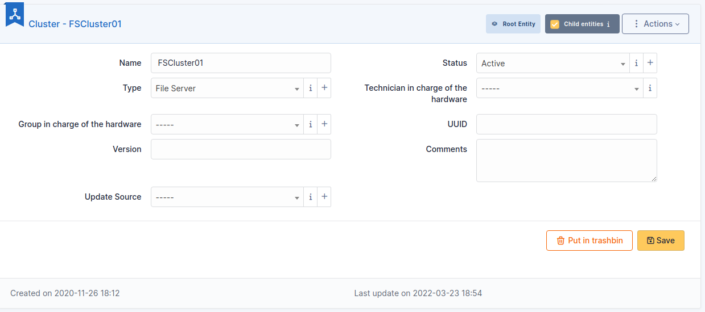
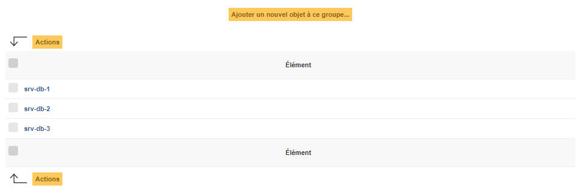
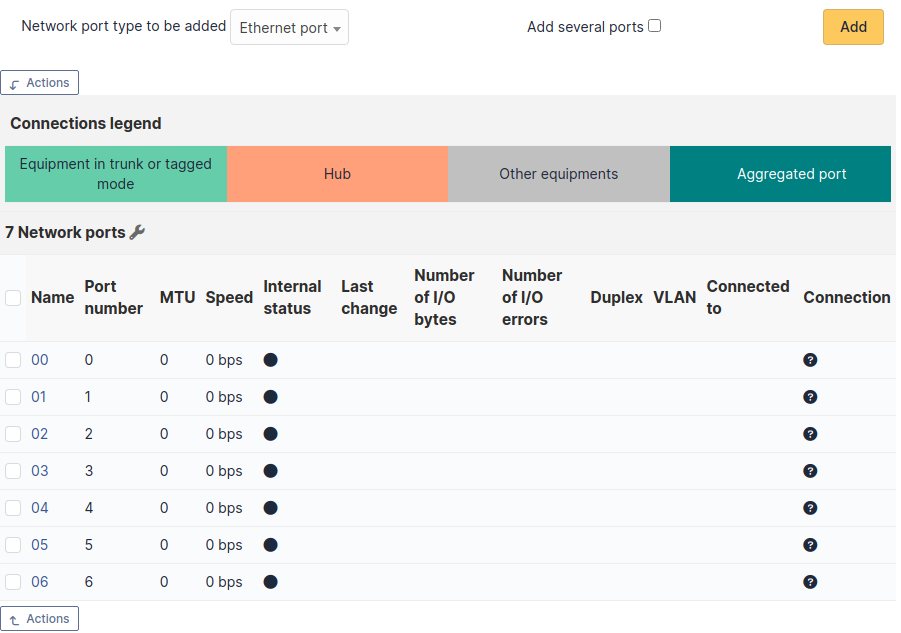

Clusters
========

A GLPI cluster is a grouping of several assets, which can be computers or network equipments.

.. note::

   GLPI clusters are taken into account when performing an impact analysis.

.. todo::
   link to impact analysis representation

Description of specific fields
------------------------------

* **UUID**: Unique identifier of the cluster
* **Version**: In the case of a software cluster, the version number can be entered
* **Update Source**: How the cluster's data were updated

The different tabs
------------------

Elements
~~~~~~~~

This tab lists the cluster's elements and allow to add new assets to the cluster.

Network ports
~~~~~~~~~~~~~

This tab list cluster's network interfaces and allows to create new ones.

Possible interfaces are:

* Ethernet port
* WiFi port
* FiberChannel port
* Port aggregate
* Port alias
* Dial up line connection
* Local loop-back

.. include:: ../tabs/contracts.rst

.. include:: ../tabs/documents.rst

.. include:: ../tabs/tickets.rst

.. include:: ../tabs/problems.rst

.. include:: ../tabs/changes.rst

.. include:: ../tabs/historical.rst

.. include:: ../tabs/all.rst
