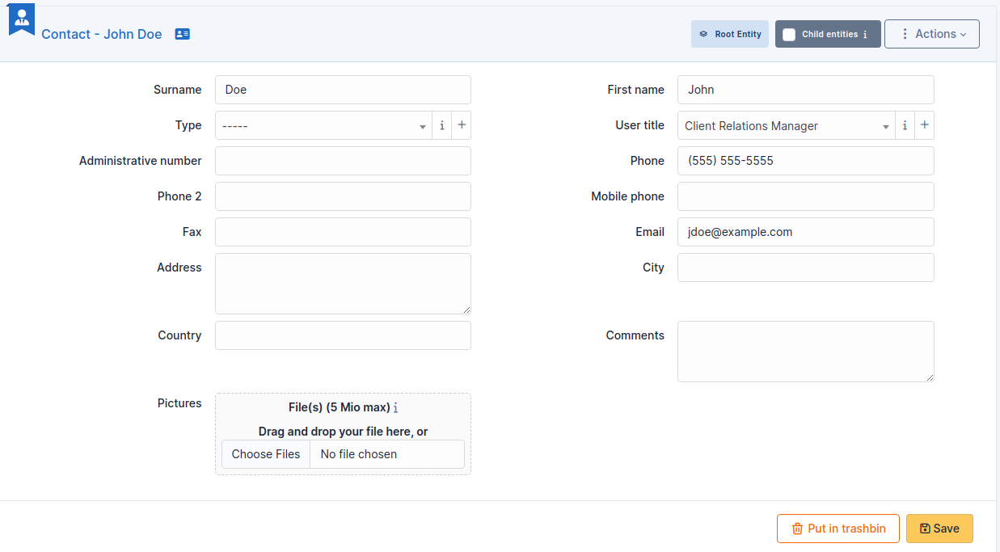

Contacts
========

GLPI users are the persons having an authentication for the GLPI application. External persons, usually associated with contracts, are known to GLPI as `Contacts`.

A contact is characterized by usual identity informations as well as title, phone number, mail address... Defining a list of contact types allows to sort contacts by types. It is also possible to export a contact in vCard format.

.. note::
   The list of possible titles for a contact is the same as the list of possible titles for users.

The different tabs
------------------

.. include:: ../tabs/suppliers.rst

.. include:: ../tabs/documents.rst

.. include:: ../tabs/external-links.rst

.. include:: ../tabs/notes.rst

.. include:: ../tabs/historical.rst

.. include:: ../tabs/all.rst

The different actions
---------------------

* :doc:`Add a contact <../../Les_différentes_actions/creer_un_nouvel_objet>`
* :doc:`Display a contact <../../Les_différentes_actions/visualiser_un_objet>`
* :doc:`Modify a contact <../../Les_différentes_actions/modifier_un_objet>`
* :doc:`Delete a contact <../../Les_différentes_actions/supprimer_un_objet>`
* :doc:`Attach a document to a contact <../../Les_différentes_actions/associer_un_document_a_un_objet>`
* :doc:`Attach a provider to a contact <../../Les_différentes_actions/associer_un_fournisseur_et_un_contact>`
* :doc:`Transfer a contact <../../Les_différentes_actions/transferer_un_objet>`
