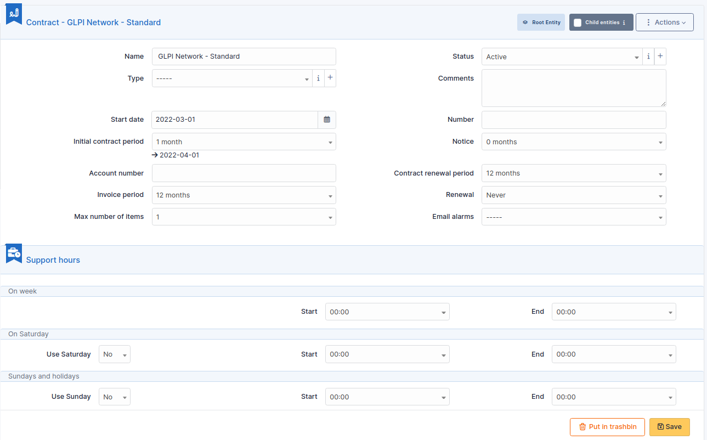

Contracts
=========

GLPI supports contracts management, in order to manage contract types such as loan, maintenance, support...

Contracts management allows to:

* make an inventory of all contracts related to the organization assets
* integrate contracts in GLPI financial management
* anticipate and follow contract renewal.

.. include:: ../tabs/templates.rst

.. note::

   It is possible to receive notifications in order to be informed of events such as contract end.
   When contract must be renewed expressly, it is useful to be notified before end of contract. For periodic contracts, it is also possible to be notified at the end of each period.
   Notifications are configured at entity level, in menu **Setup > Notifications** to define models and destination and in menu **Administration > Entities** to enable notification, define default values and a possible anticipation of notification.

Description of specific fields
------------------------------

* **Contract type**: by default, no contract type is defined, contract types must be configured in drop-down configuration;
* **Number**: contract number;
* **Start date**: date at which contract starts, all periodicity based events are computed using this date;
* **Initial contract period**: if this field and start date are given, contract end date will appear, colored in red if contract has expired;
* **Notice**: used to trigger alert notifications;
* **Account number**: used to connect with company accounting software;
* **Contract renewal period**: duration after which contract renewal is available;
* **Invoice period**: duration between invoices;
* **Renewal**: *Tacit* (the contract is automatically renewed if no party has ended it) or *Express* (needs agreement for renewal);
* **Max number of items**: attaching new items to this contract will be blocked when overflowing this number;
* **Support hours**: support hours as defined in the contract, it is possible to distinguish week days, Saturdays and Sundays/holidays.

The different tabs
------------------

Costs
~~~~~

This tab allows to define a cost related to the contract and linked to a GLPI budget: the cost of the contract will be imputed to this budget.

Suppliers
~~~~~~~~~

This tab allows to associate one or several suppliers to the contract.

.. include:: ../tabs/elements.rst

.. include:: ../tabs/documents.rst

.. include:: ../tabs/external-links.rst

.. include:: ../tabs/notes.rst

.. include:: ../tabs/historical.rst

.. include:: ../tabs/debug.rst

.. include:: ../tabs/all.rst
