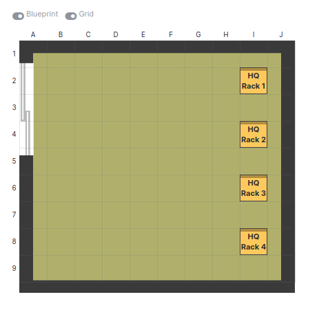
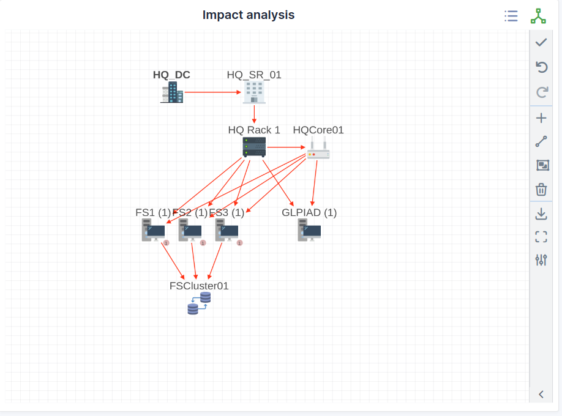

Data centers
============

Data centers management in GLPI, more precisely management of servers rooms and racks, allows to:

* Create an inventory of data centers, rooms and racks of the organization;
* Include data centers in GLPI financial management;
* Use other modules for data centers management, in particular `Assets` module which provides a detailed graphical representation of racks.

Data center
-----------

Data center in itself is a very simple object, with a name and a location, and allows only to group server rooms.

.. image:: images/data-centers.png
   :alt: A GLPI data center
   :align: center

The different tabs
~~~~~~~~~~~~~~~~~~

Server rooms
~~~~~~~~~~~~

This tab displays server rooms attached to the data center and allows to add new rooms.

.. include:: ../tabs/all.rst

Server room
-----------

A server room is represented in GLPI by a schematic map. This map gives the space available in the room to place racks.

A server room can be attached to a data center and to a location.

.. note::

   The map is a grid defined by a number of lines and columns. One rack consumes one square.
        
   The background image can enhance room visualization, in particular if this image has been generated by a dedicated tool.

The different tabs
~~~~~~~~~~~~~~~~~~

Racks
~~~~~

This tab allow to display and modify the map of a server room by adding directly on the map the racks composing the room.

If the room contains many elements, it is possible to switch from a grid view to a list view.

Impact analysis
~~~~~~~~~~~~~~~

This tab allow to display and build the impact schema for the data center.

.. include:: ../tabs/management.rst

.. include:: ../tabs/contracts.rst

.. include:: ../tabs/documents.rst

.. include:: ../tabs/external-links.rst

.. include:: ../tabs/tickets.rst

.. include:: ../tabs/problems.rst

.. include:: ../tabs/changes.rst

.. include:: ../tabs/historical.rst

.. include:: ../tabs/all.rst
