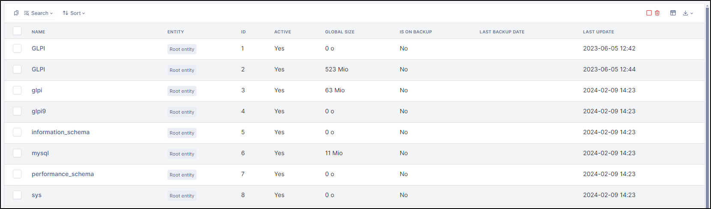
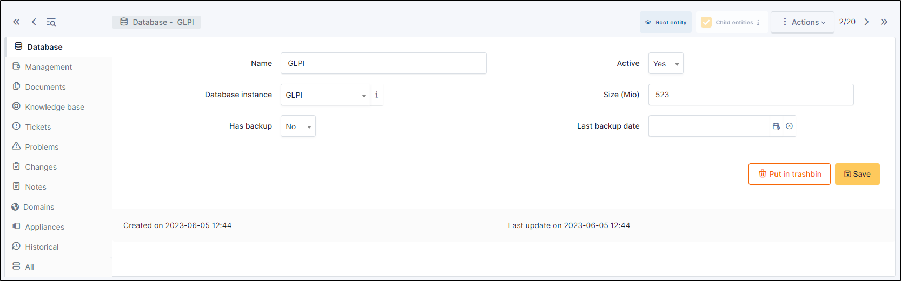

Databases
=========

Databases list databases discovered by automatic inventory and those entered manually.

Databases can be grouped into :doc:`instances <tabs/database_instances>`.
An instance groups together all the databases retrieved from the same server (for example, all the databases in a MySQL instance).
This data can also be retrieved by automatic inventory or entered manually

Database
--------

* **Name**
* **Active** : Yes/No
* **Database instance** : determines the database instance
* Size (Mio)
* Has backup: Yes/No
* Last backup date: *date*

Management
----------

:doc:`Management </modules/tabs/management>` of financial and administrative information,
this information is visible in the 'Management' tab on the Database's form.

Documents
---------

The :doc:`document </modules/management/documents>` tab lets you link different types of file to a material (PDF, txt, png, etc.)
You can attach a document already uploaded to GLPI or add a new one directly from this tab.

Knowledge Base
--------------

Lists all the articles in the :doc:`knowledge base </tabs/knowledgebase>` relating to the current item.

Tickets
-------

View all :doc:`tickets </modules/tabs/tickets>` linked to the current item.

Problems
--------

This tab refers to all related :doc:`problems </modules/assistance/problems>`.

Problems can also be linked to tickets, projects, etc. This allows you to have a complete scenario when necessary.

Changes
-------

:doc:`Changes </modules/assistance/changes>` lists all changes related to the current item. From this tab, you can't link a change directly, you can do it from **Assistance** > **Changes** > **Items**.

You can create a new change from this page, which will be linked to the current item you have selected.

Notes
-----

:doc:`Note </modules/tabs/notes>` lets you add rich-text and attach a document.

Domains
-------

You can attach :doc:`Domains </modules/management/domains>` to the current item. Domains are also linked to other items such as records, problems, etc.

Appliances
----------

:doc:`Appliances </modules/management/appliance>` include all business applications managed within GLPI and linked with the current item.

to them.
They can also be linked to another GLPI object (computer, application, etc.) as well as to another appliance.

.. include:: ../tabs/historical.rst

.. include:: ../tabs/all.rst