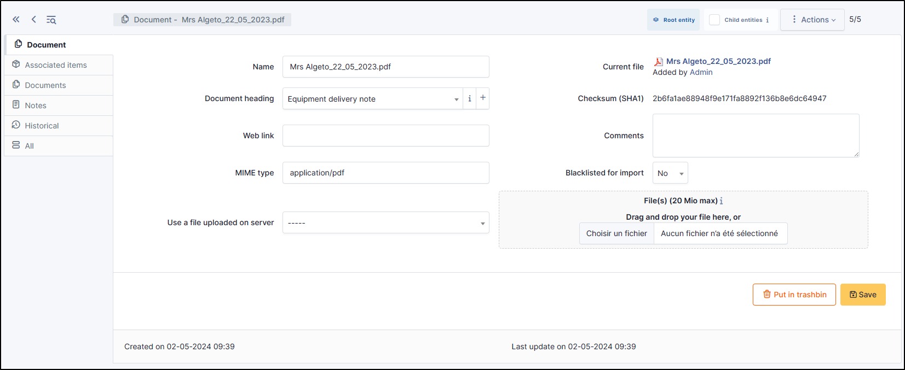

Documents
=========

Documents management in GLPI allows to store digital documents or web links sorted under different headings.

A document is described by a **name** and an **comment** and can be associated to a **heading**.

The file corresponding to the document can be added in several ways:

* From local disk;
* Using a web link pointing to a document (image, HTML page, PDF...);
* Using a file previously transferred with FTP to sub-folder */files/_uploads/* of GLPI installation

A MIME type can also be given.

.. note::
   * Document types authorized in GLPI according to their extension are defined in **Setup** > **Dropdowns** > **Management** > **Document types**
   * Document headings can be hierarchical
   * The option **Blacklisted for import** allows to exclude this document from import by collectors; it is useful for signature images, logos...

The different tabs
------------------

.. include:: ../tabs/elements.rst

Documents
~~~~~~~~~

It is possible in GLPI to attach other documents to a document, which explains why a `Document` has a `Document` tab.

.. include:: ../tabs/notes.rst

.. include:: ../tabs/historical.rst

.. include:: ../tabs/all.rst
