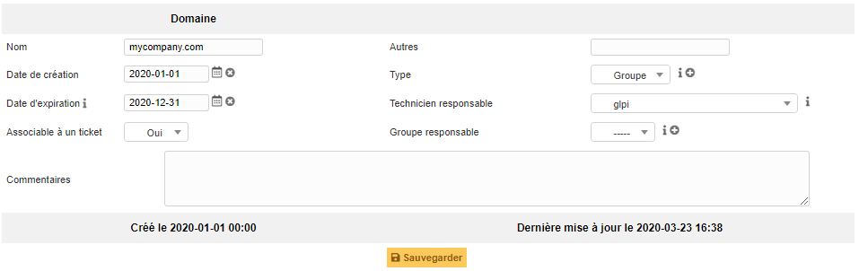
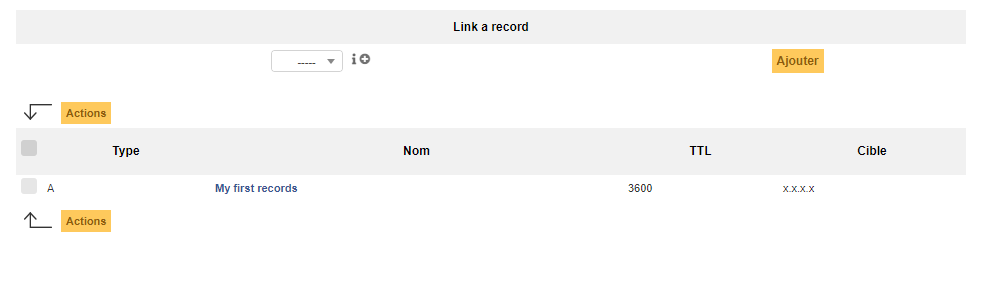
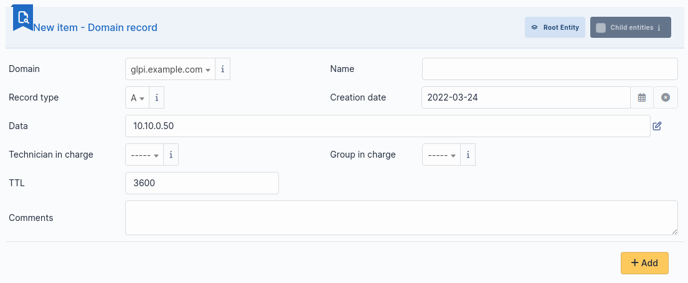

Domains
=======

Domains management in GLPI allows to manage domains (i.e. Internet domains) and domain records:

* Inventorying domain names;
* Inventorying domain records;
* Anticipating and following domain names renewal;
* Integrating domains in GLPI financial management;
* Linking assets to domains;

  .. versionchanged:: 9.5.0

* Include domains and records in GLPI assistance.

.. note::
   Access to list of domain `Records` is done via the list of `Domains`.

Domain object
-------------

A `Domain` object represents an Internet domain, with its name, expire date... This object can be attached to other objects in GLPI assistance (tickets, problems, changes).

The different tabs
~~~~~~~~~~~~~~~~~~

Records
~~~~~~~

This tab allow to create or select a domain record to be associated with the domain.

.. include:: ../tabs/elements.rst

.. include:: ../tabs/management.rst

.. include:: ../tabs/tickets.rst

.. include:: ../tabs/problems.rst

.. include:: ../tabs/changes.rst

.. include:: ../tabs/contracts.rst

.. include:: ../tabs/documents.rst

.. include:: ../tabs/external-links.rst

.. include:: ../tabs/historical.rst

.. include:: ../tabs/all.rst

Record object
-------------

A `Record` object stores all record types that can be found in a DNS zone or DNS configuration file: TXT, A, PTR, SDA, CNAME...

This object must be associated to a `Domain` object described earlier.

.. note::

   Record types are not limited to the default ones and can be customized using drop-down management.

 
The different tabs
~~~~~~~~~~~~~~~~~~

.. include:: ../tabs/tickets.rst

.. include:: ../tabs/problems.rst

.. include:: ../tabs/documents.rst

.. include:: ../tabs/external-links.rst

.. include:: ../tabs/notes.rst

.. include:: ../tabs/historical.rst

.. include:: ../tabs/all.rst
