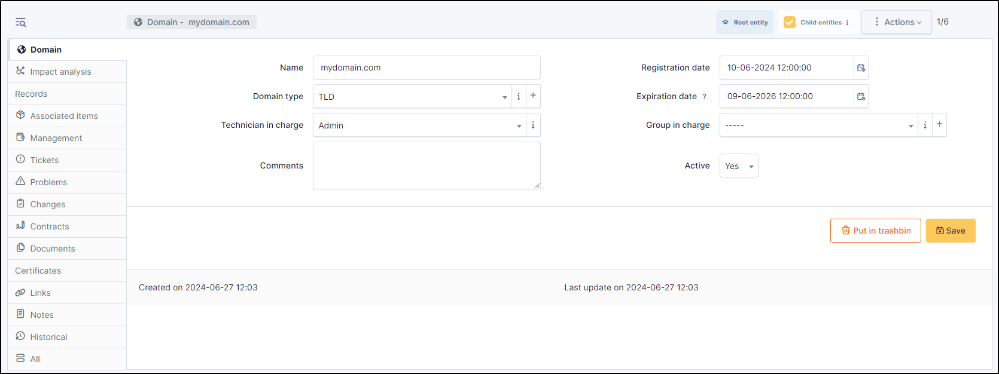
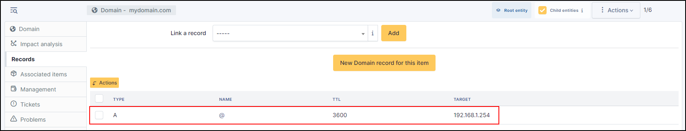

Domains
=======

Domains management in GLPI allows to manage domains (i.e. Internet domains) and domain records:

* Inventorying domain names;
* Inventorying domain records;
* Anticipating and following domain names renewal;
* Integrating domains in GLPI financial management;
* Linking assets to domains;
* Include domains and records in GLPI assistance.

.. note::
   Access to list of domain `Records` is done via the list of `Domains`.

Domain object
-------------

A `Domain` object represents an Internet domain, with its name, expire date... This object can be attached to other objects in GLPI assistance (tickets, problems, changes).

The different tabs
------------------

Impact Analysis
~~~~~~~~~~~~~~~

:doc:`Impact analysis </tabs/impact_analysis>` enables an infrastructure diagram to be drawn up, showing the dependencies and impacts in the event of equipment loss.
This can be saved and exported

Records
~~~~~~~

This tab allow to create or select a domain record to be associated with the domain.
For more information, go to :doc:`domains records </modules/management/domains_records>`

Items
~~~~~

List of all other linked GLPI :doc:`Items </tabs/item>`. You can manually add an item by selecting it from the drop-down list.

Management
~~~~~~~~~~

:doc:`Management </modules/tabs/management>` of financial and administrative information, this information is visible in the ‘Management’ tab on the object form.

Tickets
~~~~~~~

View all :doc:`tickets <../tabs/tickets>` linked to the computer

Problems
~~~~~~~~

This tab refers to all hardware-related :doc:`problems <../assistance/problems>`.
Problems can also be linked to tickets, projects, etc. This allows you to have a complete scenario when necessary.

Changes
~~~~~~~

:doc:`Changes <../assistance/changes>` lists all changes related to a material. From this tab, you can't link a change directly, you can do it from **Assistance** > **Changes** > **Items**.
You can create a new change from this page, which will be linked to the material you have selected.

Contracts
~~~~~~~~~

GLPI supports :doc:`contracts <../management/contract>` management, in order to manage contract types such as loan, maintenance, support...

Contracts management allows to:

* make an inventory of all contracts related to the organization assets
* integrate contracts in GLPI financial management
* anticipate and follow contract renewal.

Documents
~~~~~~~~~

The :doc:`document </modules/management/documents>` tab lets you link different types of file to a material (PDF, txt, png, etc.)
You can attach a document already uploaded to GLPI or add a new one directly from this tab.

Certificates
~~~~~~~~~~~~

Link a :doc:`certificate </modules/management/certificates>` to your registration

.. include:: ../tabs/historical.rst

.. include:: ../tabs/all.rst
