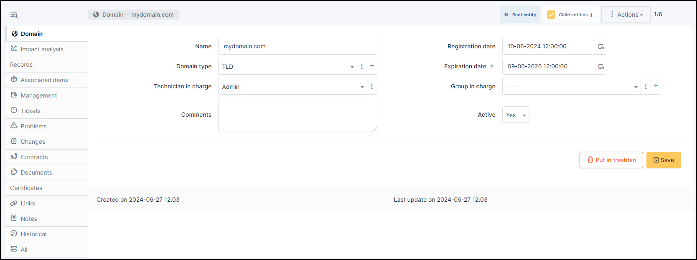

Domains records
---------------

The different tabs
------------------

Impact Analysis
~~~~~~~~~~~~~~~

:doc:`Impact analysis </tabs/impact_analysis>` enables an infrastructure diagram to be drawn up, showing the dependencies and impacts in the event of equipment loss.
This can be saved and exported

Records
~~~~~~~

A Record object stores all record types that can be found in a DNS zone or DNS configuration file: TXT, A, PTR, SDA, CNAME…

This object must be associated to a Domain object.

You can add an existing record (in Link a record field) or create a new one.

* To add a new record, click on **+Add**
* Enter the differents fields

  * Name
  * Record type
  * Technician in charge
  * Group in charge
  * Creation date
  * TTL
  * Data
* Click on **+Add**

.. note::

   Record types are not limited to the default ones and can be customized using drop-down management.

Tickets
~~~~~~~

View all :doc:`tickets </modules/assistance/tickets>` linked to the computer

Problems
~~~~~~~~

This tab refers to all hardware-related :doc:`problems <../assistance/problems>`.
Problems can also be linked to tickets, projects, etc. This allows you to have a complete scenario when necessary.

Documents
~~~~~~~~~

The :doc:`document </modules/management/documents>` tab lets you link different types of file to a material (PDF, txt, png, etc.)
You can attach a document already uploaded to GLPI or add a new one directly from this tab.

Links
~~~~~

:doc:`Links <../configuration/external_links>` offer several possibilities. Send the GLPI object file to another URL of your choice, or generate an RDP file, for example.

Note
~~~~

The :doc:`Notes </modules/tabs/notes>` tab provides a free text field for storing additional information.
Notes are displayed in the order of their creation. You can also add a document

.. include:: ../tabs/historical.rst

.. include:: ../tabs/all.rst

