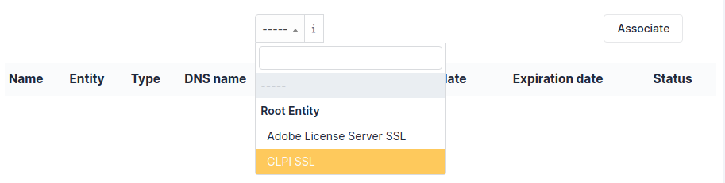

Licenses
========

Licenses management in GLPI allows to manage software licenses:

* Inventorying licenses, with links to software inventoried in GLPI;
* Following license installations on all assets;
* Linking licenses to financial management;
* Anticipating and following licenses renewal.

.. note::

   A license cannot exists in GLPI without a software associated to the license when creating it.

   License management is not automated, a human follow-up is needed for information update.

.. include:: ../tabs/templates.rst

Description of specific fields
------------------------------

* **As child of**: allows to specify if the license is dependent upon another license;
* **Version in use**: the version of the software associated with the license;
* **Purchase version**: the purchase version, which can differ from `Version in use`; if different, this field indicates it;
* **Number**: the maximum number of uses of the license by assets;
* **Allow Over-Quota**: allow or not the overflow of maximum number configured in field `Number`;
* **Expiration date**: expiration date of the license, useful to configure alerts and anticipate renewal.

Licenses
--------

This tab lists all licenses declared as child of this license.

.. note::

   Some licenses can be obtained by pack or by group, linking them by child/parent relationship allows to declare it.

To add a child license, you need to create a license from software and enter the parent license in the **as child of** field.

To unlink/modify/delete a child/parent, you can modify the entry in this same field

Summary
-------

This tab lists all types and entities of items linked to this license.

.. note::

   The number of installations must be carefully checked against the field `Number` of the license.

   Creating a link between an asset and the license id done in tab `Softwares` of the asset.

Items
-----

This tab details each item linked to the license.

.. include:: ../tabs/management.rst

.. include:: ../tabs/contracts.rst

.. include:: ../tabs/documents.rst

.. include:: ../tabs/knowledgebase.rst

.. include:: ../tabs/tickets.rst

.. include:: ../tabs/problems.rst

.. include:: ../tabs/changes.rst

.. include:: ../tabs/notes.rst

Certificates
------------

This tab allows to attach a certificate present in GLPI to the license.

.. include:: ../tabs/historical.rst

.. include:: ../tabs/all.rst

.. note:: You can prevent certain software, such as Microsoft KBs, from being brought up.
          To do this, you need to set their parameters in :doc:`Management > Dictionaries <../administration/dictionnaries>`