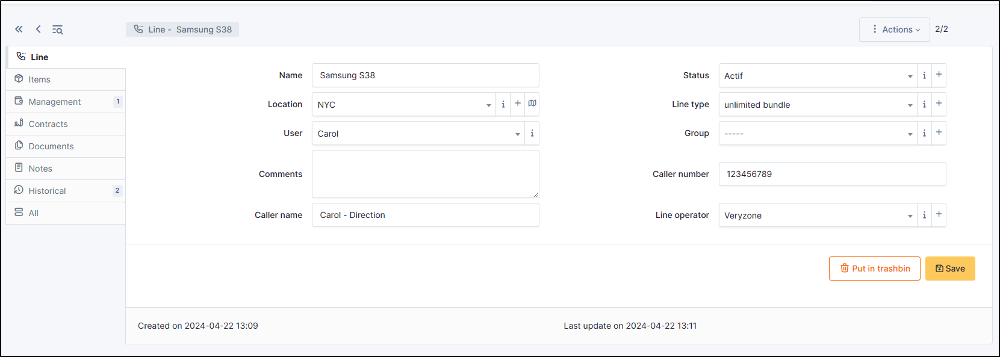

Phone lines
===========

Phone lines management in GLPI allows to:

* Create an inventory of all organization's phone lines;
* Follow information on each phone line;
* Include phone lines in GLPI financial management.

Basic fields
------------

* Name
* :doc:`Status </tabs/common_fields/status>`
* :doc:`Location </tabs/common_fields/location>`
* :doc:`User </tabs/common_fields/user>`
* :doc:`Group </tabs/common_fields/group>`
* :doc:`Comments </tabs/common_fields/comments>`
* Line type :

  * You can add an existing line type or add a new one by clicking on +.

Specific fields
---------------

* Caller number : telephone number attached to the line
* Caller name : user attached to the line
* Line operator :

  * You can add an existing operator or add a new one by clicking on +.

The different tabs
----------------------

Items
~~~~~

List of all other linked GLPI :doc:`Items </tabs/item>`. You can manually add an item by selecting it from the drop-down list.

Management
~~~~~~~~~~

:doc:`Management </modules/tabs/management>` of financial and administrative information, this information is visible in the ‘Management’ tab on the object form.

Contracts
~~~~~~~~~

GLPI supports :doc:`contracts management </modules/management/contract>`, in order to manage contract types such as loan, maintenance, support…

Contracts management allows to:

* make an inventory of all contracts related to the organization assets
* integrate contracts in GLPI financial management
* anticipate and follow contract renewal.

Documents
~~~~~~~~~

The :doc:`document </modules/management/documents>` tab lets you link different types of file to a material (PDF, txt, png, etc.)
You can attach a document already uploaded to GLPI or add a new one directly from this tab.

Note
~~~~

The :doc:`Notes </modules/tabs/notes>` tab provides a free text field for storing additional information.
Notes are displayed in the order of their creation. You can also add a document

.. include:: ../tabs/historical.rst

.. include:: ../tabs/all.rst
