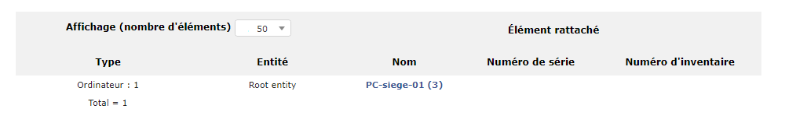
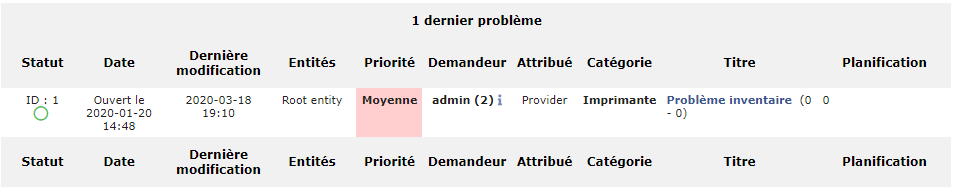
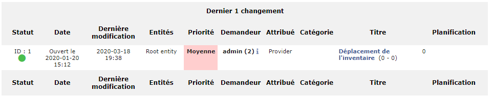

Suppliers
=========

GLPI supports suppliers management, in order to identity the supplier of an asset in asset management but also to attribute tickets to the supplier, either a person or a company.

When buying an equipment of make X from supplier Y, two distinct information must be managed in GLPI: the vendor (X) and the supplier (Y).

A supplier is characterized by a name, a third party type, a location (address, postal code, town, country) and a contact (web site, phone, fax...).

Supplier management allows to:

* reference all suppliers of organization assets
* ease contact in case of incident
* include suppliers in GLPI assistance

.. image:: images/suppliers.png
   :alt: A supplier in GLPI
   :align: center

-The different tabs
-------------------

.. include:: ../tabs/contacts.rst

.. note::

   There is a clear distinction between a supplier (which can be attached to assets) and a contact (which are the persons allowing to contact the supplier). Therefore, a supplier must be associated with contacts.

   Example : M. Doe is sale assistant in company Foo. 
   Create a supplier named Foo.
   Create a contact for M. Doe.
   Assign to this contact the type "Sale"
   Attach the contact to supplier Foo

.. include:: ../tabs/contracts.rst

Associated elements
~~~~~~~~~~~~~~~~~~~

The tab `Items` in a supplier form allows only to display associated assets. Associating an asset with a supplier is done from tab **Management** of this asset.

.. include:: ../tabs/documents.rst

.. include:: ../tabs/tickets.rst

Problems
~~~~~~~~

This tab allows to display the **Problems** associated with the supplier, i.e. all the problems for which the supplier is assigned in the field **Assigned to**.

Changes
~~~~~~~

This tab allows to display the **Changes** associated with the supplier, i.e. all the changes for which the supplier is assigned in the field **Assigned to**.

.. include:: ../tabs/external-links.rst

.. include:: ../tabs/notes.rst

.. include:: ../tabs/knowledgebase.rst

.. include:: ../tabs/historical.rst

.. include:: ../tabs/all.rst

The different actions
---------------------

*   :doc:`Add a supplier <../../Les_différentes_actions/creer_un_nouvel_objet>`
*   :doc:`Display a supplier <../../Les_différentes_actions/visualiser_un_objet>`
*   :doc:`Modify a supplier <../../Les_différentes_actions/modifier_un_objet>`
*   :doc:`Delete a supplier <../../Les_différentes_actions/supprimer_un_objet>`
*   :doc:`Attach a document to a supplier <../../Les_différentes_actions/associer_un_document_a_un_objet>`
*   :doc:`Transfer a supplier <../../Les_différentes_actions/transferer_un_objet>`
