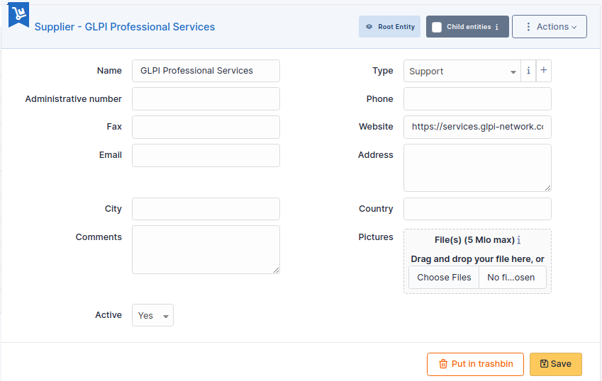

Suppliers
=========

GLPI supports suppliers management, in order to identity the supplier of an asset in asset management but also to attribute tickets to the supplier, either a person or a company.

When buying an equipment of make X from supplier Y, two distinct information must be managed in GLPI: the vendor (X) and the supplier (Y).

A supplier is characterized by a name, a third party type, a location (address, postal code, town, country) and a contact (web site, phone, fax...).

Supplier management allows to:

* reference all suppliers of organization assets
* ease contact in case of incident
* include suppliers in GLPI assistance

-The different tabs
-------------------

.. include:: ../tabs/contacts.rst

.. note::

   There is a clear distinction between a supplier (which can be attached to assets) and a contact (which are the persons allowing to contact the supplier). Therefore, a supplier must be associated with contacts.

   Example : M. Doe is sale assistant in company Foo. 
   Create a supplier named Foo.
   Create a contact for M. Doe.
   Assign to this contact the type "Sale"
   Attach the contact to supplier Foo

.. include:: ../tabs/contracts.rst

.. include:: ../tabs/elements.rst

.. include:: ../tabs/documents.rst

.. include:: ../tabs/tickets.rst

.. include:: ../tabs/problems.rst

.. include:: ../tabs/changes.rst

.. include:: ../tabs/external-links.rst

.. include:: ../tabs/notes.rst

.. include:: ../tabs/knowledgebase.rst

.. include:: ../tabs/historical.rst

.. include:: ../tabs/all.rst
