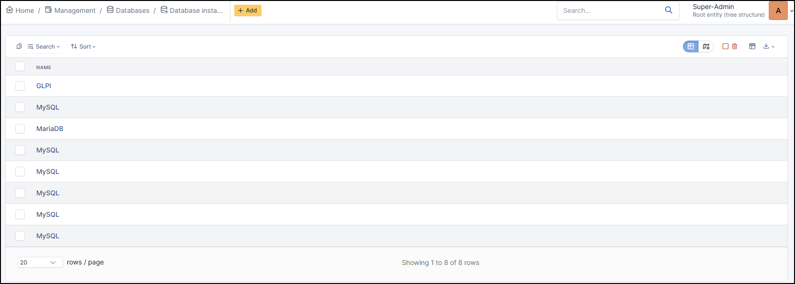
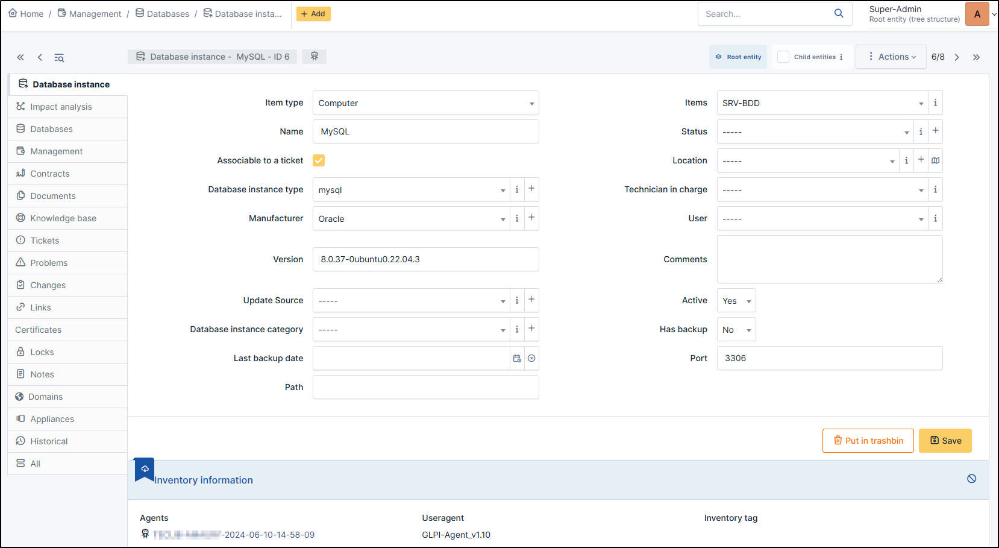

Database instances
==================

A database instance groups together all the databases retrieved from the same server (for example, all the databases in a MySQL instance).

.. note:: These instances can be added using the automatic inventory or manually

.. tip:: Note that if you modify a field manually, it will be considered locked.
          This will prevent it from being modified the next time the automatic inventory is uploaded.

          For more information, see :doc:`lock </modules/configuration/locks>`

In a database instance form, the following information is available:

* Item type : defines the **type of item** on which the database is installed
* Item : Defines the **item** on which the database installed
* Name
* :doc:`Status </tabs/common_fields/status>`
* Associable to a ticket : Yes / Note
* :doc:`Location </tabs/common_fields/location>`
* :doc:`Database instance type </tabs/common_fields/asset_type>` (MySQL, PostgreSQL, MariaDB, etc.)
* :doc:`Technician in charge </tabs/common_fields/technician_in_charge>`
* :doc:`Manufacturer </tabs/common_fields/manufacturer>`
* :doc:`User </tabs/common_fields/user>`
* Version
* :doc:`Comments </tabs/common_fields/comments>`
* :doc:`Update source </tabs/common_fields/update_source>`
* Active : Yes / No
* Database instance category
* Has backup : Ye/No
* Last backup date :*date*
* Port
* Path

Impact Analysis
---------------

:doc:`Impact analysis <../../../tabs/impact_analysis>` enables an infrastructure diagram to be drawn up, showing the dependencies and impacts in the event of equipment loss.
This can be saved and exported

Databases
---------

:doc:`Databases <../databases>` lists all the databases present on the instance

Management
----------

:doc:`Management <../../tabs/management>` of financial and administrative information, this information is visible in the 'Management' tab on the computer's form.

Contracts
---------

GLPI supports :doc:`contracts <../contract>` management, in order to manage contract types such as loan, maintenance, support...

Contracts management allows to:

* make an inventory of all contracts related to the organization assets
* integrate contracts in GLPI financial management
* anticipate and follow contract renewal.

Documents
---------

The :doc:`document <../documents>` tab lets you link different types of file to a material (PDF, txt, png, etc.)
You can attach a document already uploaded to GLPI or add a new one directly from this tab.

Knowledge Base
--------------

Lists all the articles in the :doc:`knowledge base <../../../tabs/knowledgebase>` relating to the material.

Tickets
-------

View all :doc:`tickets <../../tabs/tickets>` linked to the computer

Problems
--------

This tab refers to all hardware-related :doc:`problems <../../assistance/problems>`.
Problems can also be linked to tickets, projects, etc. This allows you to have a complete scenario when necessary.

Changes
-------

:doc:`Changes <../../assistance/changes>` lists all changes related to a material. From this tab, you can't link a change directly, you can do it from **Assistance** > **Changes** > **Items**.
You can create a new change from this page, which will be linked to the material you have selected.

Links
-----

:doc:`Links <../../configuration/external_links>` offer several possibilities. Send the GLPI object file to another URL of your choice, or generate an RDP file, for example.

Certificates
------------

Link a :doc:`certificate </modules/management/certificates>` to your registration. You can manage certificates in **Management** > **Certificates**

Locks
-----

:doc:`Locks </modules/assets/tabs/locks>` are used to prevent a field from being modified when the inventory is uploaded.
You can lock/unlock the fields you wish in a GLPI object.

Notes
-----

:doc:`Note </modules/tabs/notes>` lets you add enriched text and attach a document.

Domains
-------

You can attach :doc:`Domains </modules/management/domains>` to your computer. Domains are also linked to other objects such as records, problems, etc.

Appliances
----------

:doc:`Appliances </modules/management/appliance>` includes all business applications managed within GLPI.
They can be linked to another GLPI object (computer, application, etc.) as well as to another appliance.

.. include:: ../../tabs/historical.rst

.. include:: ../../tabs/all.rst