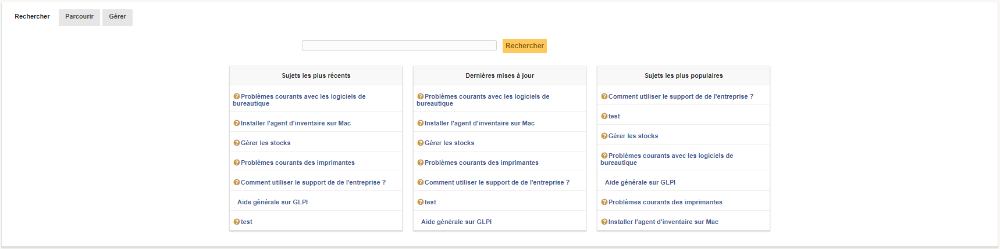
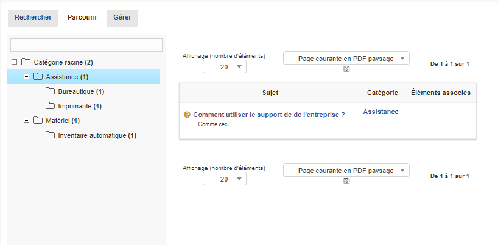
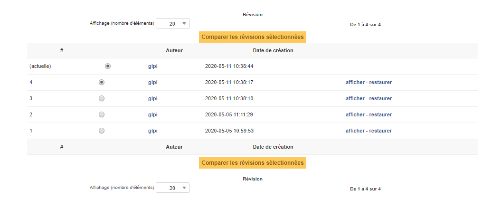
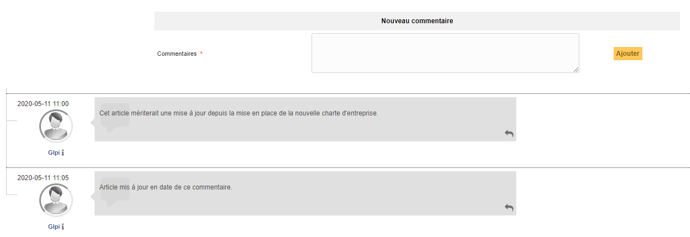

Gérer la base de connaissances
==============================

La base de connaissances de GLPI répond à deux objectifs principaux :

* Centraliser des connaissances internes pour les différents techniciens ;
* Mettre à la disposition des utilisateurs, des informations leur permettant de résoudre seuls des problèmes simples sous forme de FAQ publique.

.. note::
  Seuls les éléments de la FAQ publique sont visibles par les utilisateurs de l'interface simplifiée. Les éléments qui ne sont pas définis comme faisant partie de la FAQ publique sont visibles uniquement au sein de la console centrale par des techniciens par exemple.

Il est nécessaire de sélectionner pour chaque article de la base de connaissances ou de la FAQ une ou plusieurs cibles. La ou les cibles correspondent aux entités, profils, groupes ou utilisateurs qui pourront consulter l'article. Tant qu'aucune cible n'a été sélectionnée pour un article, ce dernier est visible uniquement par son rédacteur. L'article est considéré comme "non publié" et apparaît dans le tableau "Articles non publiés" de la page d'accueil de la base de connaissances.

Par défaut, les articles ne peuvent pas être traduits dans plusieurs langues. Cette fonctionnalité est activable (voir `la configuration générale <08_Module_Configuration/06_Générale/02_Configuration_Générale.rst>`__).

Il est possible d'associer un ou plusieurs documents aux articles de la base de connaissances.

.. note::
  Un article peut être rendu visible pendant une période
  donnée via la définition de la date de début et la date de fin de
  visibilité.

.. warning::
    Les éléments qui ne doivent pas être interprétés à
    l'affichage peuvent être définis avec le style Préformaté (``<pre>``
    en HTML). Des balises comme ``<VirtualHost>`` sont donc insérable et
    affichable. Par contre des balises au format HTML (``<BALISE>``)
    peuvent disparaître au moment de l'édition ; pour avoir une
    visibilité complète du texte vous pouvez passer en mode HTML où tous
    les éléments seront visibles. Votre navigateur peut également
    modifier dynamiquement le contenu (changement de casse, ajout de
    balises) lors d'une édition.

Il est possible de créer des catégories et sous-catégories afin d'organiser la navigation (voir `Configurer les intitulés <08_Module_Configuration/02_Intitulés/01_Intitulés.rst>`__). 

L'utilisateur peut alors utiliser plusieurs onglets pour recherche et naviguer au sein de la base de connaissances :

* **Rechercher** 
    C'est l'onglet par défaut. Il présente les articles les plus récents, les plus populaires et les dernières modifications.
    Il permet également de rechercher au sein de la base de connaissances.

* **Parcourir** 
    Cet onglet permet de naviguer au sein de l'arborescence des catégories.

* **Gérer** 
    Cet onglet n'est accessible qu'aux administrateurs de la base de connaissances. Suivant les droits de l'utilisateur, il est possible d'accéder rapidement à ses ou à tous les articles non publiés (sans cible définies) ainsi qu'à tous ses articles.

.. image:: images/manage-knowledgebase.png
        :alt: Onglet gérer de la base de connaissances
        :align: center

.. note::
    Le moteur de recherche de la base de connaissances permet d'utiliser un certain nombre d'opérateurs pour effectuer des recherches complexes : ``+ - ~ < > * ” ” ()``.

    * ``+`` Le mot doit être présent ; 
    * ``-`` Le mot ne doit pas être présent ; 
    * ``*`` Opérateur de troncature à positionner en suffixe ; 
    * ``" "`` Une phrase entre guillemets double (") est recherchée littéralement, telle qu'elle a été saisie ; 
    * ``< >`` permet de définir une préférence sur l'ordre des éléments recherchés ; 
    * ``()`` agrégateur utile pour l'utilisation de < et >.

    ::

        Exemples :

        - panne imprimante 
           -> Recherche les lignes qui contiennent au moins un de ces mots.

        - +panne +imprimante 
           -> Recherche les lignes qui contiennent ces deux mots.

        - +courriel thunderbird
           -> Recherche les lignes qui contiennent le mot *courriel*, 
              mais classe plus haut les lignes qui contiennent aussi *thunderbird*.

        - +courriel -outlook
           -> Recherche les lignes qui contiennent *courriel* mais pas *outlook*.

        - * +courriel +(>thunderbird <outlook)
          -> Recherche les lignes qui contiennent les mots *courriel* et *thunderbird*, 
             ou *courriel* et *outlook* (dans n'importe quel ordre), 
             mais classe *courriel thunderbird* plus haut que *courriel outlook*.

        - open*
           -> Trouve les lignes qui contiennent des mots tels que *openoffice*, *openwriter*, 
              *openbar* ou *openphp*.

        - "suite openoffice"
           -> Recherche les lignes qui contiennent exactement la phrase *suite openoffice*

Les différents onglets d'un article
-----------------------------------

Base de connaissances
~~~~~~~~~~~~~~~~~~~~~
Cet onglet affiche un tableau concernant l'article avec en titre, sa catégorie. Son ensuite listés son sujet et son contenu ainsi que le nom du rédacteur, des dates de création et de dernière modification, le nombre de fois où l'article a été lu ainsi que s'il fait partie ou non de la FAQ.
Si un article n'est pas publié (cible non définie), cette information apparaît en rouge au-dessus du nombre de vues.

Cible
~~~~~
Un article est considéré comme personnel par défaut. Il est, par conséquent, uniquement visible par son rédacteur.

Pour qu'un article devienne visible par d'autres utilisateurs, il est nécessaire de sélectionner une ou plusieurs cibles. La ou les cibles correspondent aux entités, profils, groupes ou utilisateurs qui pourront consulter l'article. Cet onglet permet donc d'ajouter une nouvelle cible tout en listant les cibles déjà définies.

Editer
~~~~~~
Cet onglet permet, suivant vos droits, de modifier ou supprimer un article.

.. include:: ../onglets/elements.rst

.. include:: ../onglets/documents.rst

.. include:: ../onglets/historical.rst

Révisions
~~~~~~~~~

Dans cet onglet, il est possible de consulter toutes les révisions de chaque article. C'est à dire que chaque modification de l'article donnera naissance à une révision, une version antérieure de l'article.

les révisions sont affichables et peuvent être restaurées.

Commentaires
~~~~~~~~~~~~

Un article bénéficie d'un espace commentaires, permettant aux utilisateurs de la plateforme d'échanger à son sujet.

.. include:: ../onglets/all.rst

Les différentes actions
-----------------------

*  **`Ajouter un article <Les_différentes_actions/creer_un_nouvel_objet>`__**
*  **Modifier un article** : La modification se fait dans l'onglet **Editer**.
*  **Supprimer un article** : La suppression se fait dans l'onglet **Editer**. Vu que la base de connaissances n'a pas de corbeille, un message vous demandera de confirmer votre suppression définitive.
*  **`Associer un document à un article <Les_différentes_actions/Lier_un_document_à_un_objet.rst>`__**
*  **Rendre un article public** : Il suffit d'ajouter une cible à l'article.
*  **Publier un article pendant une période donnée** : Il suffit d'ajouter une date de début et une date de fin au niveau de la visibilité.
