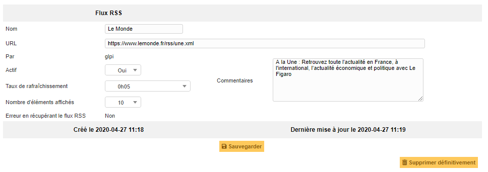

Gérer les flux RSS
==================

GLPI permet d'inclure des flux RSS dans la page d'accueil de l'outil.

Un flux RSS est considéré comme personnel par défaut. Il est, par
conséquent, uniquement visible par son rédacteur.

Pour qu'un flux RSS devienne visible par d'autres utilisateurs (flux RSS
public), il est nécessaire de sélectionner une ou plusieurs cibles. La
ou les cibles correspondent aux entités, aux profils, groupes ou
utilisateurs de la plateforme.

.. note::

	Un flux RSS public est visible pour les utilisateurs associés à un profil
	ayant le droit de lire les flux RSS publics.

Les différents onglets
----------------------

Contenu
~~~~~~~

Dans cet onglet il est possible de consulter le nombre d'éléments affichés. C'est ce contenu qui est reporté en page d'accueil.

Cibles
~~~~~~

Dans cet onglet, il est possible de consulter et modifier la liste des cibles pour le flux RSS concerné.

.. include:: ../onglets/historical.rst

.. include:: ../onglets/all.rst

Les différentes actions
-----------------------

*   :doc:`Ajouter un flux RSS <../../Les_différentes_actions/creer_un_nouvel_objet>`
*   :doc:`Visualiser/Modifier un flux RSS <../../Les_différentes_actions/visualiser_modifier_un_flux_rss>`
*   :doc:`Supprimer un flux RSS <../../Les_différentes_actions/supprimer_un_objet>`