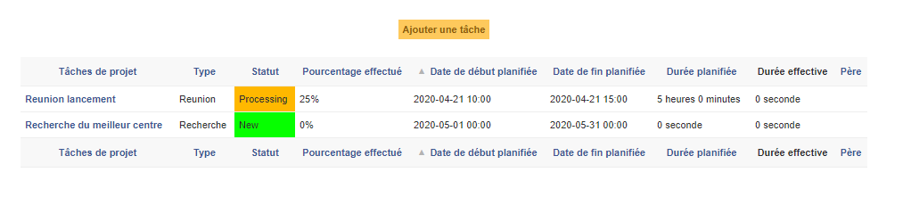
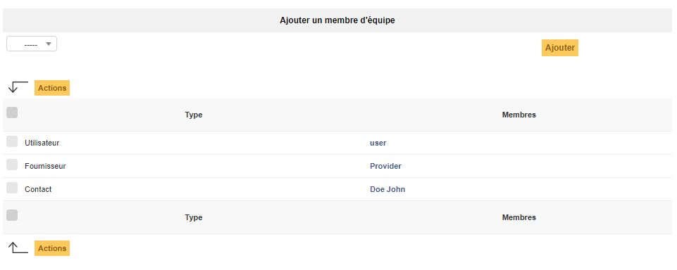
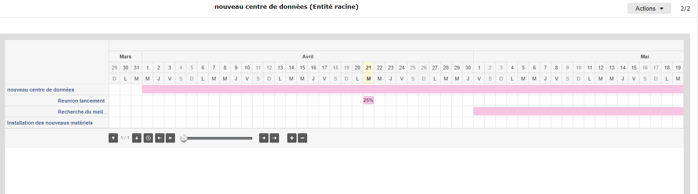
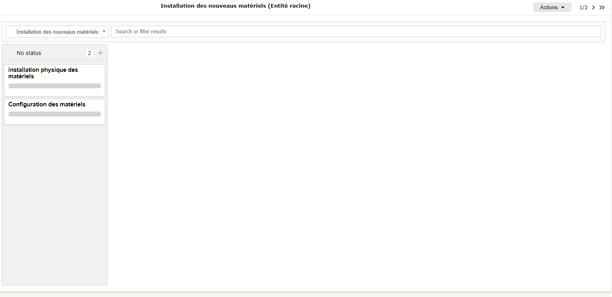

Gérer les projets
=================

La gestion de projets permet de suivre complètement l'avancement d'un
projet au sein de GLPI via la création de tâche, la constitution d'une équipe, que celui-ci soit lié à un
`changement <04_Module_Assistance/09_Changements.rst>`__ ou non. 

Un projet dans GLPI, c'est la possibilité :

- d'associer des tâches de projet et gérer leur avancement;
- d'établir une équipe projet et des équipes de tâche;
- la possibilité de déclencher des sous projets au sein d'un même projet;
- de construire un diagramme de GANTT;
- la possibilité d'utiliser la méthode Kanban;
- d'associer des coûts;
- de relier les objets ITIL de GLPI.

Le projets peut être hiérarchisé ; un projet peut donc avoir des sous-projets.

Les projets disposent de caractéristiques (nom, code,état, type...), de dates prévisionnelles et réelles ainsi qu'un pourcentage d'avancement. 

Des équipes de gestion distinctes peuvent être composées d'utilisateurs, de groupes, de fournisseurs et de contacts.

Plusieurs diagrammes de GANTT sont proposés pour chaque projet (voir
onglet *GANTT*).

Dans cette gestion de projet, il y a deux objets principaux : le projet et la tâche de projet.

Projet
------

Les différents onglets
~~~~~~~~~~~~~~~~~~~~~~

Tâches de projet
~~~~~~~~~~~~~~~~

Cet onglet permet d'ajouter une nouvelle tâche au projet. Il liste également les tâches déjà définies pour ce projet en indiquant, pour chaque tâche, son nom, son type, son statut, le pourcentage effectuée, les dates de début et de fin planifiées, les durées planifiée et effective ainsi que le nom de la tâche parent.

Equipe Projet
~~~~~~~~~~~~~

Cet onglet permet d'ajouter un membre à l'équipe, que ce soit un contact, un fournisseur, un utilisateur ou un groupe. Il liste également chaque membre de l'équipe projet ainsi que son type respectif.

Projet
~~~~~~

Cet onglet liste les sous-projets du projet. Pour définir un sous-projet, il suffit de remplir le champ "comme enfant de" d'un projet.

.. image:: images/subprojects-project.png
        :alt: Visualisation des sous projets
        :align: center

GANTT
~~~~~

Un diagramme de GANTT est proposé pour chaque projet. Un diagramme de GANTT global est également proposé incluant les projets définis comme visible dans ce diagramme.

Kanban
~~~~~~

Cet onglet met à disposition une interface afin d'utiliser la méthode Kanban dans GLPI.

Coûts
~~~~~

Des coûts sont associables aux projets, auxquels peuvent être ajouté les
coûts des tickets liées aux tâches du projet.

Objets Itil
~~~~~~~~~~~

C'est dans cet onglet qu'il est possible d'associer au projet actuel les objets itil de GLPI: tickets, problèmes et changements.
Il est possible de créer ces objets depuis cet onglet également.

.. include:: ../tabs/elements.rst

.. include:: ../tabs/documents.rst

.. include:: ../tabs/contrats.rst

.. include:: ../tabs/notes.rst

.. include:: ../tabs/historical.rst

.. include:: ../tabs/debug.rst

.. include:: ../tabs/all.rst

Tâche de projet
---------------

l'objet tâche de projet est assez similaire au projet.

une tâche de projet peut être également une sous tâche de projet.

Les tâches disposent de caractéristiques (nom, état, type...), de dates prévisionnelles et réelles ainsi qu'un pourcentage d'avancement. 

Des équipes de gestion distinctes peuvent être composées d'utilisateurs, de groupes, de fournisseurs et de contacts.

.. image:: images/task-details-project.png
        :alt: Caractérisation d'une tâche
        :align: center

.. note::

      La tâche de projet n'est pas un objet indépendant de GLPI.
      L'accès à une tache de projet se fait dans l'onglet Tâches de projet du projet concerné !

Les tâches peuvent être liées à des tickets permettant de planifier des interventions permettant de mettre en place le projet. Des durées prévisionnelles et effectives sont également définies au niveau des tâches. Ces durées ainsi que celles des tickets sont alors consolidées au niveau du projet lui même.

Les différents onglets
----------------------

Tâches de projet
~~~~~~~~~~~~~~~~

Dans cet onglet, il est possible de consulter et d'ajouter les sous-tâches.

Equipe de tâche
~~~~~~~~~~~~~~~

Ici est définie l'équipe en charge de la tâche.

.. include:: ../tabs/documents.rst

.. include:: ../tabs/tickets.rst

.. include:: ../tabs/notes.rst

.. include:: ../tabs/historical.rst

.. include:: ../tabs/all.rst

Les différentes actions
-----------------------

*   :doc:`Ajouter un projet <../../Les_différentes_actions/creer_un_nouvel_objet>`
*   :doc:`Visualiser un projet <../../Les_différentes_actions/visualiser_un_objet>`
*   :doc:`Modifier un projet <../../Les_différentes_actions/modifier_un_objet>`
*   :doc:`Supprimer un projet <../../Les_différentes_actions/supprimer_un_objet>`
*   :doc:`Associer un document à un projet <../../Les_différentes_actions/associer_un_document_a_un_objet>`
*   :doc:`Transférer un projet <../../Les_différentes_actions/transferer_un_objet>`

