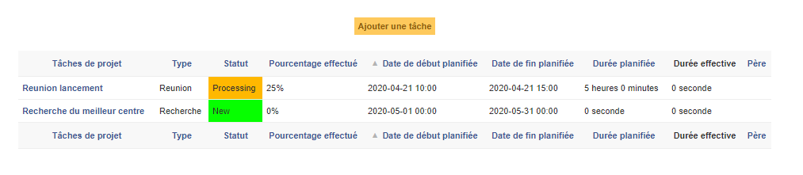
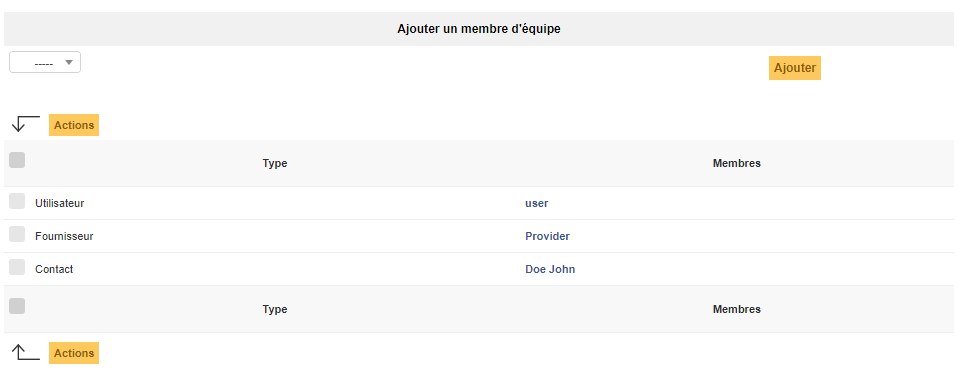
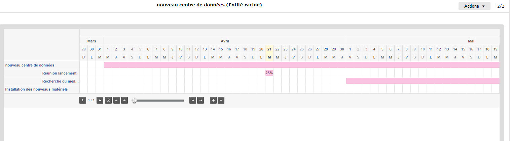
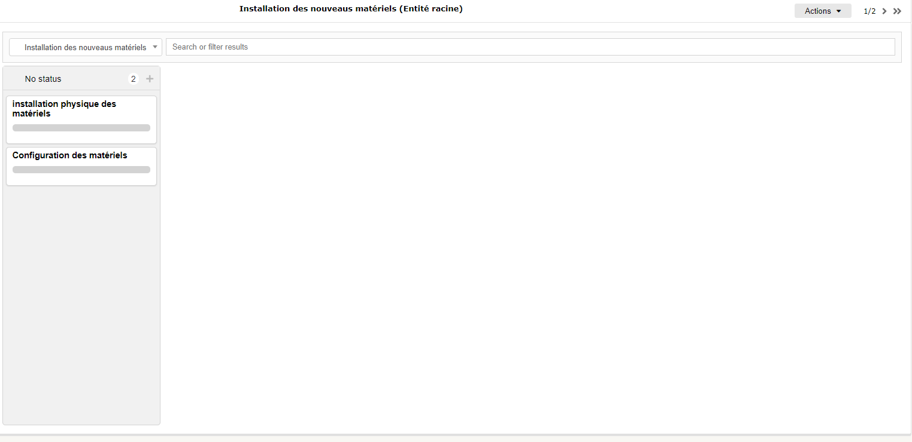

Manage projects
===============

Project management in GLPI allows to follow entirely a project's progress by creating tasks and building teams; projects can be optionally linked to a :doc:`change </modules/assistance/changes>`. 

A GLPI project allows:

* defining tasks associated to the project and following their progress;
* creating teams for a project and its tasks;
* triggering sub-projects inside the project;
* building GANTT diagrams;
* using Kanban method;
* attaching costs;
* linking to GLPI ITIL items.

A project can be hierarchical, a project can therefore have sub-projects.

A project is characterized by name, code, state, type, provisional and real dates, percent done.

Distinct management teams can by composed of users, groups, suppliers and contacts.

Several GANTT diagrams are available for each project (see tab *GANTT*).

Project management relies on two types of items: project and project task.

Project
-------

The different tabs
~~~~~~~~~~~~~~~~~~

Project tasks
~~~~~~~~~~~~~

This tab allows to add new tasks to the project. It displays also already defined tasks with, for each task, its name, type, status, planned start and end dates, real start and end dates, percent done and parent task name.

Project team
~~~~~~~~~~~~

This tab allows to add new members to the project team, this member being a contact, a supplier or a group. It lists also members of project team with for each member its type.

Project
~~~~~~~

This tab displays project's sub-projects. A sub-project is defined the same way as a project, the only difference being that the field `As child of` is defined.

GANTT
~~~~~

A GANTT diagram is available for each project. A global GANTT diagram is also available, including projects defined as visible in this global diagram (field `Show on global GANTT` of the project form).

Kanban
~~~~~~

This tab provides an interface to use Kanban method.

For more information about the Kanban feature, please refer to the :doc:`full documentation </modules/overview/kanban>`.

Costs
~~~~~

Costs can be attached to projects; the costs of the tickets attached to project's tasks will sum up to these costs.

ITIL objects
~~~~~~~~~~~~

This tab allows to attach to the project GLPI ITIL objects: tickets, problems and changes. It is also possible to create these objects directly from this tab.

.. include:: ../tabs/elements.rst

.. include:: ../tabs/documents.rst

.. include:: ../tabs/contracts.rst

.. include:: ../tabs/notes.rst

.. include:: ../tabs/historical.rst

.. include:: ../tabs/debug.rst

.. include:: ../tabs/all.rst

Project task
------------

Task item is quite similar to a project.

A project task can also be a project sub-task.

.. ??? une tâche de project peut être également une sous tâche de project.

A task is characterized by name, state, type, provisional and real dates, percent done.

Distinct management teams can by composed of users, groups, suppliers and contacts.

.. note::
   A project task is not an independent item, it can only be accessed through the `Project tasks` tab of the project owning the task.

Tasks can be attached to tickets in order to plan interventions.

Planned and actual duration are also defined for a task, reported at project level together with attached tickets duration.

The different tabs
------------------

Project tasks
~~~~~~~~~~~~~

This tab allows to display and add sub-tasks.

Task team
~~~~~~~~~

This tab defines the team in charge of the task.

.. include:: ../tabs/documents.rst

.. include:: ../tabs/tickets.rst

.. include:: ../tabs/notes.rst

.. include:: ../tabs/historical.rst

.. include:: ../tabs/all.rst
