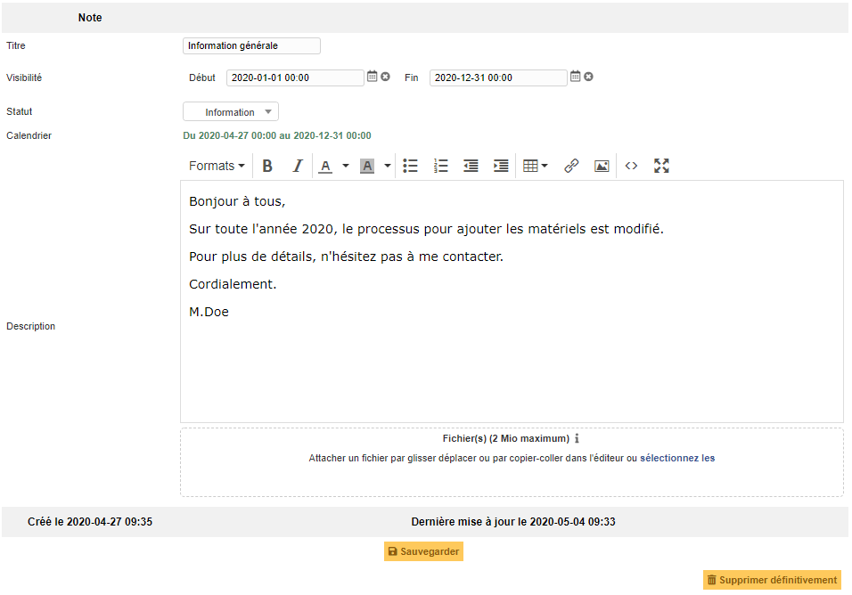
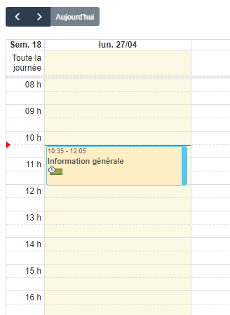
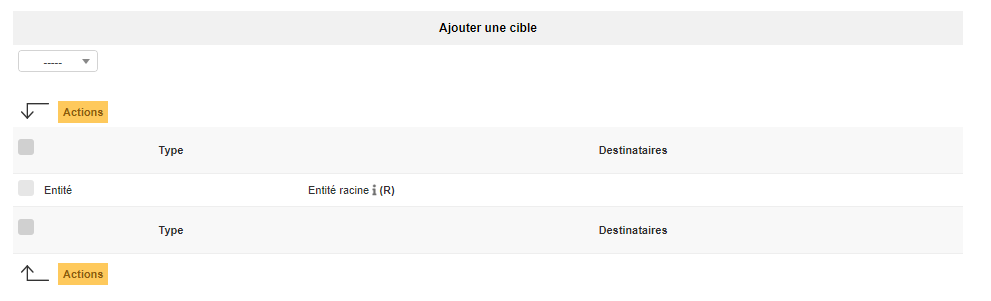

Manage personal or public reminders
===================================

A reminder in GLPI is simple text with attached files; it allows to transmit information to other users of the platform.

A reminder is characterized by:

* a lifetime;
* a status;
* the possibility to appear in planning;
* its targets.

The created reminders will then appear in GLPI home page or in targeted users' planning.

.. note::
      
   It is possible to add a start date and an end date for each reminder. If no start date is given, the reminder will be visible immediately and until its end date. If no end date is given, the reminder will be visible permanently starting from its start date.

   Adding a reminder to the planning makes it visible for targeted users of the reminder: the owner for a personal reminder, all users' plannings for a public note. A planned reminder is not deleted after its end date.

The different tabs
------------------

.. include:: ../tabs/documents.rst

Target
~~~~~~

A reminder is personal by default and therefore only visible for its writer.

For a reminder to be visible by other users (public reminder), it is necessary to add targets to the reminder. Possible targets are entity, profile, group or users.

A public reminder is visible by users associated with a profile if this profile has read permission for public reminders.

.. include:: ../tabs/historical.rst

.. include:: ../tabs/all.rst
